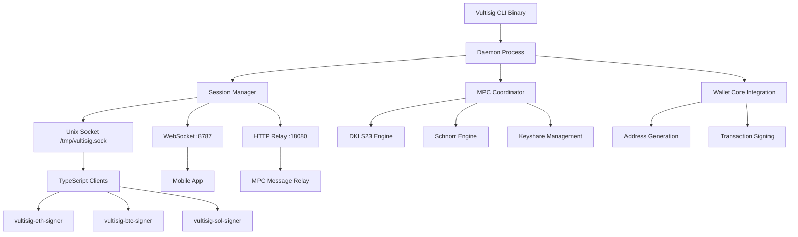

# Vultisig CLI Implementation Guide

## Overview

Vultisig CLI is a Rust-based MPC (Multi-Party Computation) signing system that enables secure 2-of-2 threshold signatures across 17+ blockchain networks. This document provides a comprehensive guide to the current implementation state, architecture, and how all components work together.

## Table of Contents

1. [Project Structure](#project-structure)
2. [Third-Party Dependencies](#third-party-dependencies)
3. [Core Architecture](#core-architecture)
4. [File-by-File Implementation Guide](#file-by-file-implementation-guide)
5. [Communication Protocols](#communication-protocols)
6. [Integration Patterns](#integration-patterns)
7. [Development Workflow](#development-workflow)
8. [Security Model](#security-model)
9. [Troubleshooting Guide](#troubleshooting-guide)

---

## Project Structure

```
vultisig-cli/
├── crates/app/                    # Main Rust application (builds to 'vultisig' binary)
│   ├── src/                       # Core Rust implementation
│   ├── proto/                     # Protobuf definitions
│   ├── tests/                     # Integration tests
│   └── Cargo.toml                 # App dependencies
├── packages/                      # TypeScript integration packages
│   ├── vultisig-eth-signer/       # Ethereum/EVM signer
│   ├── vultisig-btc-signer/       # Bitcoin UTXO signer
│   ├── vultisig-sol-signer/       # Solana signer
│   └── examples/                  # Integration examples
├── third_party/                   # External dependencies
│   ├── dkls23/                    # ECDSA MPC library
│   ├── multi-party-schnorr/      # EdDSA MPC library
│   ├── wallet-core/               # TrustWallet blockchain library
│   ├── wallet-core-build/         # Build integration
│   └── commondata/                # Protobuf schemas
├── keyshares/                     # .vult keyshare files
├── scripts/                       # Build and utility scripts
├── specs/                         # Technical specifications
└── examples/                      # Integration patterns
```

### Key Directories Explained

#### `crates/app/` - Main Application
The heart of the Vultisig CLI system. Contains all core Rust code that builds into the `vultisig` binary.

#### `packages/` - TypeScript Integration
Language bindings and client libraries that communicate with the Rust daemon via Unix sockets and WebSocket connections.

#### `third_party/` - External Dependencies
Critical external libraries that provide cryptographic primitives and blockchain functionality.

#### `keyshares/` - Vault Storage
Directory containing `.vult` files - encrypted or unencrypted keyshare files that store MPC key material.

---

## Third-Party Dependencies

### 1. DKLS23 (`third_party/dkls23/`)

**Purpose**: Distributed Key Generation and Signing for ECDSA curves (secp256k1)

**Usage**: 
- Bitcoin, Ethereum, and other ECDSA-based chains
- 2-of-2 threshold signatures
- Secure key generation and signing ceremonies

**Key Features**:
- Implements the DKLS23 protocol for threshold ECDSA
- Supports key generation, signing, and key refresh operations
- Integrated with `sl-mpc-mate` for message relay

**Integration**: Used by `engines.rs` and `tss.rs` for ECDSA operations.

### 2. Multi-Party Schnorr (`third_party/multi-party-schnorr/`)

**Purpose**: EdDSA signature scheme for ed25519 curves

**Usage**:
- Solana and other EdDSA-based chains
- Schnorr signature generation
- Ed25519 key operations

**Key Features**:
- Multi-party EdDSA key generation and signing
- Support for both keygen and signing operations
- Optimized for ed25519 curve operations

**Integration**: Used by `engines.rs` for EdDSA operations on Solana and similar chains.

### 3. TrustWallet Core (`third_party/wallet-core/`)

**Purpose**: Comprehensive blockchain library providing address derivation and transaction handling

**Usage**:
- Address generation for 17+ blockchain networks
- Transaction formatting and serialization
- BIP32 key derivation
- Network-specific cryptographic operations

**Key Components**:
- **Rust crates**: `tw_*` modules for individual blockchain support
- **C++ core**: Native implementations for performance-critical operations
- **Build system**: CMake-based compilation with Rust FFI bindings

**Integration**: Used by `wallet_core.rs` and `wallet_core_ffi.rs` for blockchain operations.

### 4. Common Data (`third_party/commondata/`)

**Purpose**: Shared protobuf schemas and data structures

**Usage**:
- Protobuf definitions for cross-language communication
- Vault metadata structures
- Keyshare serialization formats

**Key Files**:
- `proto/vultisig/`: Protobuf schema definitions
- `tokens/tokens.json`: Supported token metadata

**Integration**: Used throughout the codebase for data serialization.

### 5. Wallet Core Build (`third_party/wallet-core-build/`)

**Purpose**: Build system integration for TrustWallet Core

**Usage**:
- CMake integration with Cargo
- FFI binding generation
- Cross-platform compilation support

**Integration**: Used during build process via `build.rs` scripts.

---

## Core Architecture

### High-Level System Overview



### Communication Flow

1. **CLI Commands**: User interacts via `vultisig` CLI commands
2. **Daemon Process**: Long-running daemon manages all services
3. **Unix Socket**: JSON-RPC communication for CLI/TypeScript integration
4. **WebSocket**: Real-time communication with mobile apps
5. **HTTP Relay**: MPC message coordination between participants
6. **MPC Engines**: Execute cryptographic protocols
7. **Blockchain Integration**: Address derivation and transaction signing

---

## File-by-File Implementation Guide

### Core Library (`crates/app/src/lib.rs`)

**Purpose**: Main library entry point and server orchestration

**Key Functions**:
- `run_server()`: Starts all daemon services (WebSocket, HTTP relay, Unix socket)
- `run_server_with_keyshare()`: Alternative entry point with pre-loaded keyshare
- `find_available_port()`: Dynamic port allocation for WebSocket server
- `handle_unix_connection()`: Processes JSON-RPC requests from Unix socket

**Architecture Decisions**:
- WebSocket port is dynamically allocated (starts at 8787)
- HTTP relay port is fixed at 18080 (required by protocol specification)
- Unix socket path is fixed at `/tmp/vultisig.sock`
- Graceful shutdown handling with cleanup

**Integration Points**:
- Coordinates between `session`, `mpc_coordinator`, `websocket`, and `relay_server` modules
- Manages keyshare loading and password handling
- Provides configuration management via `ConfigFile`

### Main Binary (`crates/app/src/main.rs`)

**Purpose**: CLI interface and command handling

**Key Commands**:
- `run`: Start the daemon with keyshare loading and password management
- `address`: Display addresses for supported networks (delegates to daemon)
- `sign`: Initiate transaction signing (delegates to daemon)
- `status`: Check daemon health and service availability
- `list`: Show available keyshare files
- `init`: Initialize directory structure and config files
- `quit`: Gracefully shutdown the daemon

**Smart Features**:
- **Password Handling**: Tries passwordless loading first, then prompts interactively
- **Keyshare Discovery**: Auto-discovers first `.vult` file if none specified
- **Daemon Communication**: Delegates operations to running daemon when possible
- **Error Guidance**: Provides helpful error messages and next-step suggestions

**User Experience Design**:
- Emoji-based status indicators for clear feedback
- Retry logic for password entry (3 attempts)
- Non-interactive mode support for CI/CD environments

### Session Management (`crates/app/src/session.rs`)

**Purpose**: Manages MPC session lifecycle and participant coordination

**Key Components**:
- `SessionManager`: Tracks active sessions and participant states
- `Session`: Individual MPC session with unique ID and participant list
- Session lifecycle: Registration → Start → Message Exchange → Completion

**Session States**:
```rust
pub enum SessionState {
    Waiting,     // Waiting for participants to join
    Active,      // Session is active and processing messages
    Completed,   // Session completed successfully
    Failed,      // Session failed or timed out
}
```

**Integration Points**:
- Used by `mpc_coordinator` for session orchestration
- Provides session discovery endpoints for mobile apps
- Manages session timeouts and cleanup

### MPC Coordinator (`crates/app/src/mpc_coordinator.rs`)

**Purpose**: Orchestrates MPC operations and coordinates with cryptographic engines

**Key Responsibilities**:
- Keyshare management and loading
- MPC session coordination
- Engine selection (DKLS23 vs Schnorr based on curve type)
- Message routing between participants
- Session state management

**Engine Selection Logic**:
```rust
match curve_type {
    CurveType::Secp256k1 => use_dkls23_engine(),
    CurveType::Ed25519 => use_schnorr_engine(),
}
```

**Session Coordination**:
- Manages participant registration and validation
- Coordinates message exchange between parties
- Handles session completion and result collection
- Provides session status and progress tracking

### Network Layer (`crates/app/src/network.rs`)

**Purpose**: JSON-RPC server implementation and network utilities

**Supported RPC Methods**:
- `get_address`: Get address for specific network
- `get_addresses_with_pubkeys`: Get all addresses with public keys
- `sign`: Initiate transaction signing
- `get_session_status`: Check MPC session status
- `shutdown`: Gracefully shutdown daemon

**JSON-RPC Implementation**:
```rust
pub async fn handle_json_rpc_request(
    request: &str,
    session_manager: Arc<SessionManager>,
    mpc_coordinator: Arc<MpcCoordinator>,
) -> String
```

**Network Utilities**:
- Address validation and formatting
- Network name normalization
- Error response formatting
- Request/response serialization

### WebSocket Server (`crates/app/src/websocket.rs`)

**Purpose**: Real-time communication with mobile applications

**Key Features**:
- WebSocket server on dynamically allocated port (default 8787)
- Mobile app discovery and connection management
- Real-time MPC message exchange
- Session status broadcasting

**Message Types**:
- Session join requests from mobile apps
- MPC protocol messages
- Session status updates
- Error notifications

**Integration**:
- Works with `session` module for participant management
- Coordinates with `mpc_coordinator` for message routing
- Provides mobile app discovery endpoints

### HTTP Relay Server (`crates/app/src/relay_server.rs`)

**Purpose**: HTTP-based MPC message relay and service discovery

**Key Endpoints**:
- `POST /start/{session_id}`: Start MPC session
- `POST /{session_id}`: Register participant in session
- `POST /message/{session_id}`: Send MPC message
- `GET /message/{session_id}/{party_id}`: Retrieve messages
- `GET /health`: Health check endpoint
- `GET /discovery`: Service discovery for mobile apps

**Message Relay**:
- Store-and-forward message delivery
- Participant authentication and validation
- Message encryption and integrity verification
- Session-based message isolation

**Service Discovery**:
```rust
pub async fn create_relay_server_with_mpc_support(
    port: u16,
    session_manager: Arc<SessionManager>,
    mpc_coordinator: Arc<MpcCoordinator>,
    websocket_port: u16,
) -> RelayServer
```

### Local Server (`crates/app/src/local_server.rs`)

**Purpose**: mDNS-based service discovery and local network communication

**Key Features**:
- mDNS service advertisement (`_http._tcp`)
- Local network discovery for mobile apps
- Service name generation and registration
- Network interface detection

**mDNS Integration**:
- Advertises service on local network
- Provides connection information to mobile apps
- Handles service name conflicts and resolution
- Supports multiple network interfaces

### Keyshare Management (`crates/app/src/keyshare.rs`)

**Purpose**: Vault keyshare loading, validation, and cryptographic operations

**Keyshare Format**:
```rust
pub struct VultKeyshare {
    pub vault_name: String,
    pub public_key_ecdsa: String,
    pub public_key_eddsa: String,
    pub hex_chain_code: String,
    pub key_shares: Vec<KeyShare>,
    pub signers: Vec<String>,
}
```

**Key Operations**:
- Load keyshares from `.vult` files (encrypted/unencrypted)
- Derive addresses for supported networks
- Extract public keys for different curves
- Validate keyshare integrity and format

**Security Features**:
- Password-based encryption support
- Secure memory handling for key material
- Keyshare validation and integrity checks
- Support for multiple keyshare formats

### TSS Implementation (`crates/app/src/tss.rs`)

**Purpose**: Threshold Signature Scheme implementation and engine coordination

**Supported Algorithms**:
- **ECDSA**: Via DKLS23 for secp256k1 curves (Bitcoin, Ethereum)
- **EdDSA**: Via multi-party-schnorr for ed25519 curves (Solana)

**Key Operations**:
- Key generation ceremonies
- Signature generation
- Key refresh operations
- Message hash preparation

**Engine Coordination**:
```rust
pub enum TssEngine {
    Dkls23(Dkls23Engine),
    Schnorr(SchnorrEngine),
}
```

### Cryptographic Engines (`crates/app/src/engines.rs`)

**Purpose**: Wrapper around third-party MPC libraries

**DKLS23 Integration**:
- Secp256k1 key generation and signing
- Distributed key generation protocol
- Threshold signature generation
- Key refresh and recovery operations

**Schnorr Integration**:
- Ed25519 key operations
- Multi-party Schnorr signatures
- EdDSA-specific optimizations
- Curve25519 operations

**Engine Selection**:
- Automatic selection based on target blockchain
- Curve-specific optimizations
- Protocol-specific message handling

### Wallet Core Integration (`crates/app/src/wallet_core.rs` & `wallet_core_ffi.rs`)

**Purpose**: Blockchain address derivation and transaction handling

**Address Derivation**:
- BIP32 hierarchical deterministic key derivation
- Network-specific address formats
- Support for 17+ blockchain networks
- Public key to address conversion

**Supported Networks**:
- Bitcoin (P2WPKH, Bech32)
- Ethereum (EIP-55 checksummed addresses)
- Solana (Base58 encoded addresses)
- Cosmos SDK chains (Bech32 with network prefix)
- And many more...

**Transaction Support**:
- Transaction input preparation
- Signature placeholder insertion
- Transaction serialization
- Network-specific transaction formats

### QR Code Handling (`crates/app/src/qr.rs`)

**Purpose**: QR code generation for mobile app integration

**QR Code Types**:
- **Vault Sharing**: JSON metadata for vault import
- **Keygen Sessions**: Compressed protobuf for key generation
- **Keysign Sessions**: Transaction signing coordination
- **Address Display**: Plain address strings

**Compression and Encoding**:
- 7zip/LZMA compression for large payloads
- Base64 encoding for safe transport
- Server-side storage for oversized payloads
- Protocol buffer serialization

**Mobile Integration**:
- Deep link URL generation (`vultisig://vultisig.com`)
- Session parameter encoding
- Encryption key distribution
- Payload size optimization

### Broadcasting (`crates/app/src/broadcaster.rs`)

**Purpose**: Transaction broadcasting to blockchain networks

**Network Support**:
- Bitcoin: Broadcast to Bitcoin network nodes
- Ethereum: EVM-compatible network broadcasting
- Solana: Solana cluster transaction submission
- Cosmos: Cosmos SDK chain broadcasting

**Broadcasting Features**:
- Multiple RPC endpoint support
- Retry logic with exponential backoff
- Transaction status tracking
- Error handling and recovery

### Signing Coordination (`crates/app/src/signing.rs`)

**Purpose**: High-level signing workflow coordination

**Signing Process**:
1. Transaction preparation and validation
2. Pre-signing hash generation
3. MPC session initialization
4. Cryptographic signing ceremony
5. Signature compilation and verification
6. Transaction broadcasting (optional)

**Integration Points**:
- Coordinates between `mpc_coordinator`, `tss`, and `wallet_core`
- Manages signing session lifecycle
- Provides progress tracking and error handling
- Supports both local and relay signing modes

---

## Communication Protocols

### 1. Unix Socket JSON-RPC

**Location**: `/tmp/vultisig.sock`

**Purpose**: CLI and TypeScript client communication

**Protocol**: JSON-RPC 2.0 over Unix domain socket

**Example Request/Response**:
```json
// Request
{
  "id": 1,
  "method": "get_address",
  "params": {
    "network": "eth"
  }
}

// Response
{
  "id": 1,
  "result": {
    "address": "0x3B47C2D0678F92ECd8f54192D14d541f28DDbE97",
    "public_key": "03ac0f333fc5d22f929e013be80988f57a56837db64d968c126ca4c943984744fd"
  }
}
```

### 2. WebSocket Protocol

**Location**: `ws://localhost:8787/ws`

**Purpose**: Real-time mobile app communication

**Message Types**:
- Session join notifications
- MPC protocol messages
- Status updates
- Error notifications

### 3. HTTP Relay Protocol

**Location**: `http://localhost:18080`

**Purpose**: MPC message relay and session coordination

**Key Endpoints**:
```
POST /start/{session_id}           # Start session
POST /{session_id}                 # Join session
POST /message/{session_id}         # Send message
GET /message/{session_id}/{party}  # Get messages
GET /health                        # Health check
```

### 4. mDNS Service Discovery

**Service Type**: `_http._tcp`

**Purpose**: Local network service discovery

**Advertisement Data**:
- Service name: `Vultisig-{hostname}`
- Port: 18080
- TXT records: Service metadata

---

## Integration Patterns

### 1. TypeScript Integration

**Ethereum Signer Example**:
```typescript
import { VultisigSigner } from "vultisig-eth-signer";
import { JsonRpcProvider } from "ethers";

const provider = new JsonRpcProvider("https://eth.llamarpc.com");
const signer = new VultisigSigner(provider, "/tmp/vultisig.sock");

const tx = await signer.sendTransaction({
  to: "0x742d35Cc6634C0532925a3b8D6Ac6E2b8c2C5E00",
  value: ethers.parseEther("0.1")
});
```

**Communication Flow**:
1. TypeScript client connects to Unix socket
2. Sends JSON-RPC request to daemon
3. Daemon coordinates MPC signing with mobile app
4. Returns signed transaction to client
5. Client broadcasts transaction

### 2. Direct CLI Usage

**Address Generation**:
```bash
# Start daemon
vultisig run --vault keyshares/my-vault.vult

# Get addresses (in another terminal)
vultisig address --network btc,eth,sol
```

**Transaction Signing**:
```bash
# Sign transaction
vultisig sign --network ETH --payload-file transaction.json
```

### 3. Mobile App Integration

**QR Code Flow**:
1. Generate keysign QR code with session parameters
2. Mobile app scans QR code and extracts session info
3. Mobile app joins MPC session via WebSocket
4. Coordinated signing ceremony between CLI and mobile
5. Transaction completion and broadcasting

---

## Development Workflow

### Building the Project

1. **Initialize Submodules**:
   ```bash
   git submodule update --init --recursive
   ```

2. **Build Wallet Core** (first time only):
   ```bash
   ./scripts/build-wallet-core.sh
   ```

3. **Build Rust Binary**:
   ```bash
   cargo build --release --features wallet-core
   ```

4. **Build TypeScript Packages**:
   ```bash
   cd packages/vultisig-eth-signer && npm run build
   cd packages/vultisig-btc-signer && npm run build
   cd packages/vultisig-sol-signer && npm run build
   ```

### Testing

1. **Unit Tests**:
   ```bash
   cargo test --features wallet-core
   ```

2. **Integration Tests**:
   ```bash
   cargo test --test integration_tests
   ```

3. **End-to-End Testing**:
   ```bash
   # Terminal 1: Start daemon
   ./target/release/vultisig run --vault keyshares/test.vult
   
   # Terminal 2: Test operations
   vultisig status
   vultisig address --network eth
   ```

### Development Features

**Feature Flags**:
- `default = ["wallet-core"]`: Enable full blockchain integration
- `dev-mode`: Development-specific features
- `wallet-core`: TrustWallet Core integration

**Environment Variables**:
- `RUST_LOG=debug`: Enable debug logging
- `VULTISIG_CONFIG`: Custom config file path

---

## Security Model

### Key Management

1. **Keyshare Security**:
   - `.vult` files contain encrypted key material
   - Password-based encryption using industry standards
   - Secure memory handling in Rust
   - No private keys stored in plaintext

2. **Session Security**:
   - Unique session IDs for each MPC ceremony
   - Session-specific encryption keys
   - Message authentication and integrity verification
   - Participant validation and authorization

3. **Communication Security**:
   - Unix socket permissions (0o660)
   - WebSocket over localhost only
   - Encrypted MPC messages
   - TLS for external relay connections

### Threat Model

**Protected Against**:
- Key extraction from individual devices
- Man-in-the-middle attacks on MPC messages
- Replay attacks via sequence numbering
- Unauthorized session participation

**Trust Assumptions**:
- Both keyshare holders must be honest
- Local device security is maintained
- Network communication is secure
- Mobile app integrity is preserved

---

## Troubleshooting Guide

### Common Issues

1. **"Command not found: vultisig"**
   ```bash
   # Solution: Build the binary and add to PATH
   cargo build --release
   export PATH=$PWD/target/release:$PATH
   ```

2. **"No .vult files found"**
   ```bash
   # Solution: Initialize and copy keyshares
   vultisig init
   cp your-vault.vult ./keyshares/
   ```

3. **"Daemon is not running"**
   ```bash
   # Solution: Start daemon in separate terminal
   vultisig run --vault keyshares/your-vault.vult
   ```

4. **"Address already in use (port 8787)"**
   - WebSocket port is dynamically allocated
   - Daemon will find next available port automatically
   - Check `vultisig status` for actual port

5. **"Cannot connect to daemon"**
   ```bash
   # Check if daemon is running
   vultisig status
   
   # Check Unix socket exists
   ls -la /tmp/vultisig.sock
   
   # Restart daemon if needed
   vultisig quit
   vultisig run --vault your-vault.vult
   ```

### Debug Information

**Enable Debug Logging**:
```bash
RUST_LOG=debug vultisig run --vault your-vault.vult
```

**Check Service Status**:
```bash
# WebSocket health
curl -v ws://localhost:8787/ws

# HTTP relay health  
curl http://localhost:18080/health

# Unix socket test
echo '{"id":1,"method":"get_address","params":{"network":"eth"}}' | nc -U /tmp/vultisig.sock
```

**Network Diagnostics**:
```bash
# Check port usage
lsof -i :8787
lsof -i :18080

# Check Unix socket
ls -la /tmp/vultisig.sock
```

---

## Conclusion

The Vultisig CLI system represents a comprehensive MPC signing solution that bridges multiple programming languages, blockchain networks, and device types. The architecture is designed for:

- **Security**: Threshold signatures with no single point of failure
- **Usability**: Simple CLI interface with smart defaults
- **Extensibility**: Modular design supporting new blockchains and protocols
- **Reliability**: Robust error handling and recovery mechanisms
- **Performance**: Efficient cryptographic operations and message handling

The system successfully demonstrates how complex cryptographic protocols can be made accessible through well-designed APIs and user interfaces, while maintaining the highest security standards required for cryptocurrency operations.

For developers looking to integrate with Vultisig, the TypeScript packages provide the easiest entry point, while the direct CLI interface offers maximum flexibility for custom implementations. The modular architecture ensures that new blockchain networks and signing protocols can be added without disrupting existing functionality.
