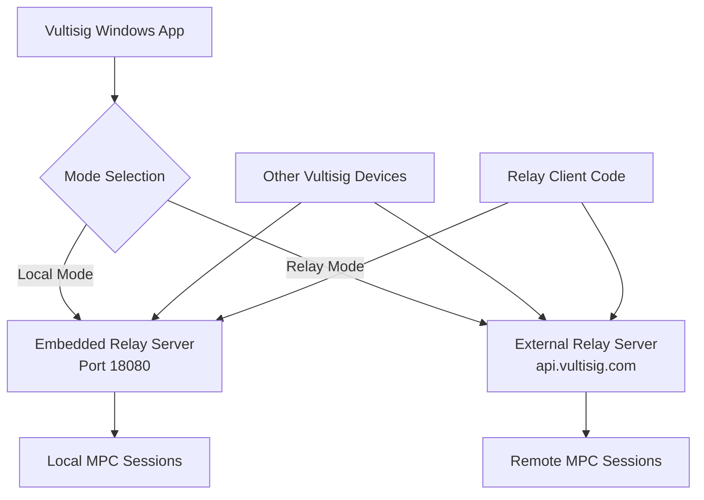

# Vultisig Mediator: Relay Server Wrapper Specification

## Overview

The Vultisig Windows application implements a **dual-role architecture** where it acts as both a relay client and an optional embedded relay server. The `mediator` package provides a thin wrapper around the `vultisig-relay` library to enable local MPC session coordination with mDNS service discovery.

## Architecture Overview



## Core Dependencies

The mediator requires the following Go dependencies:

```go
require (
    github.com/vultisig/vultisig-relay v1.x.x  // Core relay server
    github.com/hashicorp/mdns v1.x.x           // mDNS service discovery
)
```

## Wrapper Structure

### Server Struct

```go
// mediator/mediator.go
package mediator

import (
    "fmt"
    "os"
    "strings"
    "sync"
    "time"

    m "github.com/hashicorp/mdns"
    "github.com/vultisig/vultisig-relay/server"
    "github.com/vultisig/vultisig-relay/storage"
)

const (
    MediatorPort = 18080
)

// Server wraps the vultisig-relay server with additional functionality
type Server struct {
    localServer *server.Server  // The actual relay server
    mdns        *m.Server       // mDNS service for discovery
}
```

### Initialization Pattern

```go
func NewRelayServer() (*Server, error) {
    // Step 1: Create in-memory storage for the relay server
    store, err := storage.NewInMemoryStorage()
    if err != nil {
        return nil, fmt.Errorf("failed to create storage: %w", err)
    }
    
    // Step 2: Create the actual relay server instance
    relayServer := server.NewServer(MediatorPort, store)
    
    // Step 3: Wrap it in your custom server struct
    return &Server{
        localServer: relayServer,
        mdns:        nil, // Will be set when advertising
    }, nil
}
```

## Server Lifecycle Management

### Starting the Server

```go
// Start the relay server in a goroutine
func (r *Server) StartServer() error {
    return r.localServer.StartServer()
}
```

### Stopping the Server

```go
// Stop the relay server gracefully
func (r *Server) StopServer() error {
    // Stop mDNS advertising first
    if err := r.StopAdvertiseMediator(); err != nil {
        // Log but don't fail - continue with server shutdown
        fmt.Printf("Warning: failed to stop mDNS advertising: %v\n", err)
    }
    
    // Stop the actual relay server
    return r.localServer.StopServer()
}
```

## mDNS Service Discovery Integration

### Service Advertisement

```go
// Advertise the relay server via mDNS for local discovery
func (r *Server) AdvertiseMediator(name string) error {
    hostName, err := os.Hostname()
    if err != nil {
        return fmt.Errorf("could not determine host: %v", err)
    }
    
    // Ensure proper .local suffix
    const localSuffix = ".local"
    if strings.HasSuffix(hostName, localSuffix) {
        hostName = strings.TrimSuffix(hostName, localSuffix)
    }
    hostName = fmt.Sprintf("%s%s.", hostName, localSuffix)
    
    // Create mDNS service entry
    mdnsService, err := m.NewMDNSService(
        name,           // Service instance name
        "_http._tcp",   // Service type
        "",            // Domain (empty for local)
        hostName,      // Host name
        MediatorPort,  // Port
        nil,           // IPs (auto-detected)
        []string{name}, // TXT records
    )
    if err != nil {
        return fmt.Errorf("failed to create mDNS service: %w", err)
    }
    
    // Start mDNS server
    mdnsServer, err := m.NewServer(&m.Config{Zone: mdnsService})
    if err != nil {
        return fmt.Errorf("failed to start mDNS server: %w", err)
    }
    
    r.mdns = mdnsServer
    fmt.Printf("Successfully advertising mediator '%s' on %s:%d\n", name, hostName, MediatorPort)
    return nil
}
```

### Service Discovery

```go
// Discover other relay servers on the network
func (r *Server) DiscoveryService(name string) (string, error) {
    entriesCh := make(chan *m.ServiceEntry, 4)
    wg := &sync.WaitGroup{}
    wg.Add(1)
    
    var err error
    var serviceHost string
    
    // Goroutine to process mDNS entries
    go func() {
        defer wg.Done()
        for {
            select {
            case <-time.After(5 * time.Second):
                err = fmt.Errorf("service discovery timeout")
                return
            case entry := <-entriesCh:
                // Check if this entry matches our service name
                for _, txt := range entry.InfoFields {
                    if txt == name {
                        serviceHost = fmt.Sprintf("%s:%d", entry.AddrV4, entry.Port)
                        return
                    }
                }
            }
        }
    }()
    
    // Query for HTTP services
    param := &m.QueryParam{
        Service:     "_http._tcp",
        Timeout:     5 * time.Second,
        Entries:     entriesCh,
        DisableIPv6: true,
    }
    
    if err := m.Query(param); err != nil {
        return "", fmt.Errorf("mDNS query failed: %w", err)
    }
    
    wg.Wait()
    return serviceHost, err
}

// Stop mDNS advertising
func (r *Server) StopAdvertiseMediator() error {
    if r.mdns != nil {
        if err := r.mdns.Shutdown(); err != nil {
            return fmt.Errorf("failed to stop mDNS server: %w", err)
        }
        r.mdns = nil
    }
    return nil
}
```

## Application Integration

### Main Application Setup

```go
func main() {
    // Create the relay server wrapper
    mediator, err := mediator.NewRelayServer()
    if err != nil {
        panic(fmt.Sprintf("Failed to create relay server: %v", err))
    }
    
    // Start the server in a goroutine
    go func() {
        if err := mediator.StartServer(); err != nil {
            log.Printf("Relay server exited: %v", err)
        }
    }()
    
    // For Wails applications, bind the mediator to the frontend
    err = wails.Run(&options.App{
        // ... other options ...
        OnShutdown: func(ctx context.Context) {
            // Graceful shutdown
            if err := mediator.StopServer(); err != nil {
                log.Printf("Failed to stop mediator: %v", err)
            }
        },
        Bind: []interface{}{
            mediator, // Expose mediator methods to frontend
            // ... other services ...
        },
    })
}
```

### Frontend Integration (TypeScript)

```typescript
// Generated Wails bindings
import { DiscoveryService } from '../wailsjs/go/mediator/Server'

// Usage in your app
const getMpcServerUrl = async ({ serverType, serviceName }) => {
    if (serverType === 'relay') {
        return 'https://api.vultisig.com/router' // Remote relay
    }
    
    // Use local discovery for local mode
    return DiscoveryService(serviceName)
}
```

## Dual Role Architecture

The Vultisig Windows app has a **dual role**:

### 1. Server Role (Local Mode)
- Runs an embedded `vultisig-relay` server
- Other devices connect to it via mDNS discovery
- Acts as the coordination point for MPC sessions

### 2. Client Role (Both Modes)
- Uses `relay.Client` to communicate with relay servers
- Sends/receives MPC messages via HTTP API
- Participates in MPC ceremonies

## Client Usage Pattern

The app uses relay clients to communicate with either mode:

```go
// relay/session.go - This is the CLIENT code
type Client struct {
    vultisigRelay string    // Server URL (local or remote)
    client        http.Client
}

func NewClient(vultisigRelay string) *Client {
    return &Client{
        vultisigRelay: vultisigRelay,  // Could be local or remote
        client: http.Client{Timeout: 5 * time.Second},
    }
}

// Client methods that make HTTP calls to relay server
func (s *Client) StartSession(sessionID string, parties []string) error {
    sessionURL := s.vultisigRelay + "/start/" + sessionID
    // Makes HTTP POST to relay server
}
```

## Operational Modes

### Local Mode Configuration
```go
const localConfig = {
    serverUrl: "http://127.0.0.1:18080",
    mode: "local"
}
```

**Characteristics:**
- Uses embedded relay server on port 18080
- Direct peer-to-peer communication
- No external dependencies
- Requires network connectivity between participants
- Uses mDNS for service discovery

**Benefits:**
- Lower latency
- No external server dependency
- Enhanced privacy
- Direct device communication

### Relay Mode Configuration
```go
const relayConfig = {
    serverUrl: "https://api.vultisig.com/router",
    mode: "relay"
}
```

**Characteristics:**
- Uses Vultisig's hosted relay service
- Messages routed through central server
- Works across different networks
- Requires internet connectivity

**Benefits:**
- Works across NAT/firewall boundaries
- No local server setup required
- Reliable message delivery
- Cross-network compatibility

## Key Design Patterns

1. **Composition over Inheritance**: Wrap the relay server rather than extending it
2. **Graceful Shutdown**: Always stop mDNS before stopping the server
3. **Error Handling**: Provide meaningful error messages with context
4. **Service Discovery**: Integrate mDNS for zero-configuration networking
5. **Lifecycle Management**: Handle startup and shutdown properly

## Configuration Constants

```go
const (
    MediatorPort = 18080              // Fixed port for local relay
    ServiceType = "_http._tcp"        // mDNS service type
    DiscoveryTimeout = 5 * time.Second // Service discovery timeout
)
```

## Best Practices

- **Always use in-memory storage** for the relay server (sessions are ephemeral)
- **Handle mDNS failures gracefully** (network may not support multicast)
- **Use proper error wrapping** with context for debugging
- **Start server in goroutine** to avoid blocking main thread
- **Implement graceful shutdown** to clean up resources properly

## Why This Design?

This architecture allows:
- **Local Mode**: No internet required, direct device-to-device communication
- **Relay Mode**: Works across networks/firewalls via hosted service
- **Seamless Switching**: Same client code works with both modes
- **Zero Configuration**: mDNS auto-discovery for local servers

## Summary

The mediator package is a **thin wrapper** around the `vultisig-relay` library that:
- Embeds a relay server instance for local mode operation
- Adds mDNS service discovery for zero-configuration networking
- Provides lifecycle management for the embedded server
- Exposes discovery services to the frontend via Wails bindings

The app is both a client (always) and an optional server (local mode only), enabling flexible deployment scenarios while maintaining a consistent API for MPC message coordination.
