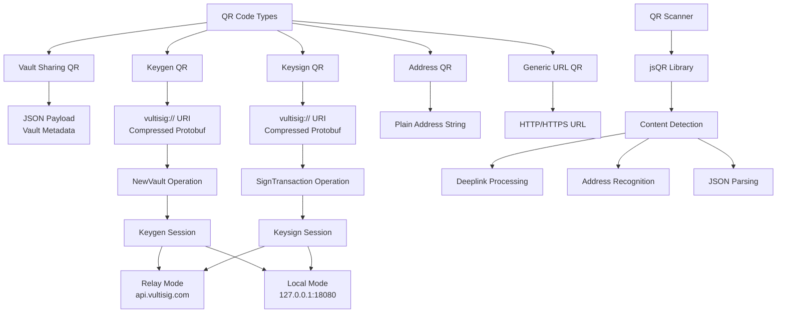

# VultiSig QR Code Specification

## Overview

This document provides a comprehensive specification for QR codes used in the VultiSig ecosystem. VultiSig uses QR codes for various operations including vault sharing, multi-party computation (MPC) keygen operations, transaction signing (keysign), and address scanning. The system supports both relay and local modes with different URI schemes and payload formats.

## Architecture Overview



## QR Code Types

### 1. Vault Sharing QR Codes

**Purpose**: Share vault metadata between devices for importing existing vaults.

**Format**: Plain JSON string (not URI-based)

**Structure**:
```json
{
  "uid": "vault-unique-identifier",
  "name": "Vault Name",
  "public_key_ecdsa": "03ac0f333fc5d22f929e013be80988f57a56837db64d968c126ca4c943984744fd",
  "public_key_eddsa": "dff9b5b456eadcbd99366fd691f50f865a26df433f9cbffe1b6f319ecadb8308",
  "hex_chain_code": "c39c57cd4127a5c5d6c8583f3f12d7be26e7eed8c398e7ee9926cd33845cae1b"
}
```

**Fields**:
- `uid`: Unique identifier for the vault (generated from vault metadata)
- `name`: Human-readable vault name
- `public_key_ecdsa`: ECDSA public key (secp256k1) in hex format
- `public_key_eddsa`: EdDSA public key (ed25519) in hex format  
- `hex_chain_code`: BIP32 chain code for key derivation (32 bytes hex)

**Usage**: Displayed in vault sharing interface, scanned by other devices to import vault metadata.


### 3. Keysign QR Codes

**Purpose**: Initiate multi-party transaction signing sessions.

**URI Scheme**: `vultisig://vultisig.com`

**Base Format**:
```
vultisig://vultisig.com?type=SignTransaction&vault={VAULT_ID}&jsonData={COMPRESSED_PAYLOAD}
```

**Query Parameters**:
- `type`: Always `"SignTransaction"` for keysign operations
- `vault`: Target vault identifier
- `jsonData`: Base64-encoded, 7zip-compressed protobuf payload

#### Keysign Message Payload

**Protobuf Schema**: `KeysignMessage`

**Fields**:
```typescript
{
  sessionId: string                    // Unique session identifier
  serviceName: string                 // mDNS service name for discovery
  encryptionKeyHex: string           // AES encryption key for MPC messages
  useVultisigRelay: boolean          // true = relay mode, false = local mode
  payloadId?: string                 // Server-stored payload ID (for large payloads)
  keysignPayload?: KeysignPayload    // Inline transaction payload
  customMessagePayload?: CustomMessagePayload // Custom message signing
}
```

#### Keysign Payload Structure

**Transaction Signing**:
```typescript
{
  coin: {
    chain: string           // Blockchain identifier (e.g., "Ethereum", "Bitcoin")
    address: string         // Wallet address
    decimals: number        // Token decimals
    hexPublicKey: string    // Public key for this chain
    ticker: string          // Token symbol
  }
  toAddress: string         // Recipient address
  toAmount: string          // Amount to send (in smallest unit)
  memo?: string             // Optional transaction memo
  swapPayload?: SwapPayload // Swap-specific data
  approvePayload?: ApprovePayload // Token approval data
  // Blockchain-specific fields...
}
```

**Custom Message Signing**:
```typescript
{
  message: string           // Message to sign (hex or plain text)
  derivedPublicKey: string  // Public key for signing
  coin: CoinMeta           // Chain metadata
  isPersonalSign: boolean   // Use personal_sign for Ethereum
}
```

### 4. Address QR Codes

**Purpose**: Represent blockchain addresses for receiving funds.

**Format**: Plain address string (no URI wrapper)

**Examples**:
- Bitcoin: `bc1qsef7rshf0jwm53rnkttpry5rpveqcd6dyj6pn9`
- Ethereum: `0x8c4E1C2D3b9F88bBa6162F6Bd8dB05840Ca24F8c`
- Cosmos: `thor1nuwfr59wyn6da6v5ktxsa32v2t6u2q4veg9awu`
- Solana: `G5Jm9g1NH1xprPz3ZpnNmF8Wkz2F6YUhkxpf432mRefR`

**Usage**: Generated from vault public keys and chain-specific derivation paths.

### 5. Generic URL QR Codes

**Purpose**: Handle external URLs and web-based operations.

**Format**: Standard HTTP/HTTPS URLs

**Examples**:
- `https://example.com/transaction/abc123`
- `https://app.vultisig.com/vault/import?data=...`

## Relay vs Local Mode

### Relay Mode

**Characteristics**:
- Uses VultiSig's hosted relay service
- Server URL: `https://api.vultisig.com/router`
- Works across different networks and NAT boundaries
- Requires internet connectivity

**QR Code Differences**:
- `useVultisigRelay: true` in message payloads
- Messages routed through central relay server
- Higher latency but better connectivity

**Example Keygen URL**:
```
vultisig://vultisig.com?type=NewVault&tssType=Keygen&jsonData=eJwrysxLLU...
```

### Local Mode

**Characteristics**:
- Uses embedded relay server on port 18080
- Server URL: `http://127.0.0.1:18080`
- Direct peer-to-peer communication via mDNS discovery
- Requires local network connectivity

**QR Code Differences**:
- `useVultisigRelay: false` in message payloads
- Messages routed through local relay server
- Lower latency but requires same network

**Example Keygen URL**:
```
vultisig://vultisig.com?type=NewVault&tssType=Keygen&jsonData=eJwrysxLLU...
```
*(Same URL format, difference is in the payload content)*

## Payload Compression and Size Management

### Compression Algorithm

**Method**: 7zip (LZMA) compression with Base64 encoding

**Process**:
1. Serialize data to protobuf binary format
2. Compress using 7zip LZMA algorithm
3. Base64 encode the compressed data
4. Include in QR code as `jsonData` parameter

**Implementation**:
```typescript
const sevenZip = await getSevenZip()
const jsonData = toCompressedString({
  sevenZip,
  binary: protobufData,
})
```

### Size Limitations

**QR Code Limits**:
- Maximum URL length: 2048 characters
- QR code capacity varies by error correction level
- Large payloads may exceed practical scanning limits

**Large Payload Handling**:

When a keysign QR code exceeds the URL length limit, the system:

1. **Uploads payload to server**:
```typescript
const payloadId = await uploadPayloadToServer({
  payload: compressedPayload,
  serverUrl: mpcServerUrl[serverType],
})
```

2. **Creates compact QR code with reference**:
```typescript
const keysignMessage = {
  sessionId,
  serviceName,
  encryptionKeyHex,
  useVultisigRelay,
  payloadId, // Reference to server-stored payload
  // No inline payload
}
```

3. **Retrieval process**:
```typescript
if (keysignMsg.payloadId) {
  const rawPayload = await getPayloadFromServer({
    hash: keysignMsg.payloadId,
    serverUrl,
  })
  const payload = await decompressQrPayload(rawPayload)
  keysignMsg.keysignPayload = fromBinary(KeysignPayloadSchema, payload)
}
```

## QR Code Generation

### Libraries Used

**QR Code Generation**: `qrcode` npm package
**QR Code Scanning**: `jsqr` npm package

### Generation Parameters

```typescript
<QRCode
  fgColor="#FFFFFF"        // White foreground
  bgColor="#000000"        // Black background (or transparent)
  size={qrCodeDefaultSize} // Configurable size (typically 256-512px)
  value={qrCodeContent}    // The actual content string
/>
```

### File Naming Conventions

**Keygen QR Codes**: `VaultKeygenQR-{VaultName}-{UID}`
**Keysign QR Codes**: `VaultKeysignQR-{VaultName}-{UID}`
**Vault Sharing QR Codes**: `VaultQR-{VaultName}-{UID}`

Where `{UID}` is the last 3 characters of the vault's unique identifier.

## QR Code Scanning

### Scanner Implementation

**Camera Access**:
```typescript
const stream = await navigator.mediaDevices.getUserMedia({
  video: {
    width: { min: 640, ideal: 1920, max: 3840 },
    height: { min: 480, ideal: 1080, max: 2160 },
    frameRate: { ideal: 30, max: 60 },
  },
})
```

**Scanning Process**:
1. Capture video frame to canvas
2. Extract image data from canvas
3. Process with jsQR library
4. Return decoded string data

**Content Processing**:
```typescript
const onScanSuccess = (value: string) => {
  if (value.startsWith('http')) {
    // Handle as generic URL
    navigate({ id: 'deeplink', state: { url: value } })
  } else if (value.startsWith('vultisig://')) {
    // Handle as VultiSig deeplink
    navigate({ id: 'deeplink', state: { url: value } })
  } else if (isValidAddress(value)) {
    // Handle as blockchain address
    navigate({ id: 'send', state: { address: value } })
  } else {
    try {
      // Try parsing as vault sharing JSON
      const vaultData = JSON.parse(value)
      // Process vault import...
    } catch {
      // Unknown format
      showError('Unknown QR code format')
    }
  }
}
```

### Upload from Image

**File Processing**:
```typescript
const processQrImage = async (file: File) => {
  const imageBitmap = await createImageBitmap(file)
  const canvas = document.createElement('canvas')
  canvas.width = imageBitmap.width
  canvas.height = imageBitmap.height
  
  const context = canvas.getContext('2d')
  context.drawImage(imageBitmap, 0, 0)
  
  const imageData = context.getImageData(0, 0, canvas.width, canvas.height)
  const code = jsQR(imageData.data, imageData.width, imageData.height)
  
  return code?.data
}
```

## Deeplink Processing

### URL Structure

**Base URL**: `vultisig://vultisig.com`

**Query Parameters**:
- `type`: Operation type (`"NewVault"` or `"SignTransaction"`)
- `tssType`: TSS operation (`"Keygen"` or `"Reshare"`) - only for NewVault
- `vault`: Vault identifier - only for SignTransaction
- `jsonData`: Compressed payload data

### Processing Pipeline

1. **URL Parsing**:
```typescript
const queryParams = getRawQueryParams<DeeplinkParams>(url)
const { jsonData } = queryParams
```

2. **Payload Decompression**:
```typescript
const payload = await decompressQrPayload(jsonData)
```

3. **Protobuf Deserialization**:
```typescript
const message = fromBinary(MessageSchema, payload)
```

4. **Operation Routing**:
```typescript
match(queryParams.type, {
  NewVault: () => navigate({ id: 'joinKeygen', state: { keygenMsg } }),
  SignTransaction: () => navigate({ id: 'joinKeysign', state: { keysignMsg, vaultId } }),
})
```

## Security Considerations

### Message Encryption

**MPC Messages**: All MPC protocol messages are encrypted using the session encryption key
- **TypeScript**: AES-GCM encryption
- **Go Backend**: AES-CBC encryption

**QR Code Content**: QR codes themselves contain only:
- Session coordination data (session ID, server URL, encryption key)
- Transaction metadata (amounts, addresses, etc.)
- No private keys or sensitive cryptographic material

### Session Isolation

- Each MPC session uses a unique session ID
- Encryption keys are session-specific
- Messages cannot cross session boundaries
- Participants are validated per session

### Payload Integrity

- Compressed payloads include integrity checks
- Protobuf deserialization validates structure
- Invalid or corrupted QR codes are rejected
- Hash verification for server-stored payloads

## Error Handling

### Common Error Scenarios

1. **QR Code Scanning Failures**:
   - Poor image quality or lighting
   - Damaged or partially obscured QR codes
   - Unsupported QR code formats

2. **Payload Processing Errors**:
   - Decompression failures
   - Protobuf deserialization errors
   - Missing required fields

3. **Network Connectivity Issues**:
   - Server-stored payload retrieval failures
   - Relay server unavailability
   - Local server discovery failures

### Error Recovery

```typescript
const { error } = await attempt(processQrCode(qrData))
if (error) {
  // Log error details
  console.error('QR processing failed:', error)
  
  // Show user-friendly error message
  showError(t('qr_processing_failed'))
  
  // Allow retry or alternative input methods
  setRetryAvailable(true)
}
```

## Integration Examples

### Complete Keygen Flow

```typescript
// 1. Generate keygen URL
const keygenUrl = await getJoinKeygenUrl({
  serverType: 'relay',
  sessionId: generateSessionId(),
  serviceName: generateServiceName(),
  hexEncryptionKey: generateEncryptionKey(),
  vaultName: 'My New Vault',
  keygenOperation: { create: true },
})

// 2. Display as QR code
<QRCode value={keygenUrl} />

// 3. Other devices scan and process
const processedUrl = await processDeeplink(scannedUrl)

// 4. Join keygen session
await joinKeygenSession(processedUrl.keygenMsg)
```

### Complete Keysign Flow

```typescript
// 1. Generate keysign URL
const keysignUrl = await getJoinKeysignUrl({
  serverType: 'local',
  sessionId: generateSessionId(),
  serviceName: generateServiceName(),
  hexEncryptionKey: generateEncryptionKey(),
  vaultId: vault.id,
  payload: {
    keysign: {
      coin: selectedCoin,
      toAddress: recipientAddress,
      toAmount: sendAmount,
      // ... other transaction details
    }
  }
})

// 2. Display as QR code
<QRCode value={keysignUrl} />

// 3. Other devices scan and join signing
const processedUrl = await processDeeplink(scannedUrl)
await joinKeysignSession(processedUrl.keysignMsg, processedUrl.vaultId)
```

### Vault Sharing

```typescript
// 1. Generate vault sharing data
const vaultShareData = JSON.stringify({
  uid: getVaultExportUid(vault),
  name: vault.name,
  public_key_ecdsa: vault.publicKeys.ecdsa,
  public_key_eddsa: vault.publicKeys.eddsa,
  hex_chain_code: vault.hexChainCode,
})

// 2. Display as QR code
<QRCode value={vaultShareData} />

// 3. Import on other device
const vaultMetadata = JSON.parse(scannedData)
await importVaultMetadata(vaultMetadata)
```

## Performance Considerations

### QR Code Size Optimization

- Use maximum compression for large payloads
- Implement server-side payload storage for oversized content
- Choose appropriate error correction levels
- Optimize protobuf message structure

### Scanning Performance

- Use appropriate camera resolution settings
- Implement frame rate limiting to reduce CPU usage
- Cache decompression utilities
- Provide fallback upload options

### Network Efficiency

- Implement connection pooling for server requests
- Use appropriate timeouts for network operations
- Cache frequently accessed data
- Implement retry logic with exponential backoff

## Best Practices

### QR Code Design

1. **High Contrast**: Use black on white or white on black
2. **Adequate Size**: Ensure QR codes are large enough for reliable scanning
3. **Error Correction**: Use appropriate error correction levels
4. **Quiet Zone**: Maintain proper margins around QR codes

### User Experience

1. **Clear Instructions**: Provide guidance on how to scan QR codes
2. **Fallback Options**: Offer alternative input methods (file upload, manual entry)
3. **Progress Indication**: Show scanning status and processing progress
4. **Error Messages**: Provide clear, actionable error messages

### Security

1. **Validate Content**: Always validate and sanitize scanned content
2. **Session Timeouts**: Implement appropriate session timeouts
3. **Encryption**: Use strong encryption for sensitive data
4. **Audit Logging**: Log security-relevant events

## Conclusion

The VultiSig QR code system provides a comprehensive solution for coordinating multi-party cryptographic operations across devices. The specification supports multiple operation types, both relay and local modes, efficient payload compression, and robust error handling.

Key features include:

1. **Multiple QR Types**: Vault sharing, keygen, keysign, addresses, and generic URLs
2. **Dual Mode Support**: Both relay and local server modes
3. **Payload Optimization**: Compression and server-side storage for large payloads
4. **Security**: Session isolation, encryption, and integrity verification
5. **User Experience**: Camera scanning, file upload, and clear error handling

The system is designed to be extensible, secure, and user-friendly while supporting the complex requirements of threshold signature scheme operations in a multi-device environment.
