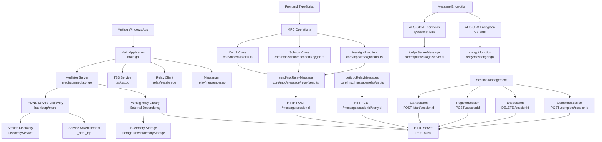

# Vultisig Relay Server Implementation Specification

## Overview

The Vultisig Windows application implements a sophisticated relay server system for Multi-Party Computation (MPC) operations. This document provides a comprehensive specification of how the relay server is correctly implemented.

## Architecture Diagram



## Core Components

### 1. Mediator Server (`mediator/mediator.go`)

The mediator server is the core component that wraps the external `github.com/vultisig/vultisig-relay` library.

**Key Features:**
- Embedded HTTP server on port 18080
- In-memory storage for session management
- mDNS service advertisement for network discovery

**Implementation:**
```go
func NewRelayServer() (*Server, error) {
    store, err := storage.NewInMemoryStorage()
    if err != nil {
        return nil, err
    }
    s := server.NewServer(MediatorPort, store)
    return &Server{
        localServer: s,
    }, nil
}
```

**Methods:**
- `StartServer()`: Starts the HTTP relay server
- `StopServer()`: Cleanly shuts down the server
- `AdvertiseMediator(name)`: Advertises service via mDNS
- `DiscoveryService(name)`: Discovers other relay servers on the network

### 2. Session Management (`relay/session.go`)

Provides comprehensive session lifecycle management for MPC operations.

**Session Lifecycle:**
1. **Registration**: Parties register with their unique IDs
2. **Start**: Coordinator starts session when all parties join
3. **Message Exchange**: Encrypted MPC messages relayed between parties
4. **Completion**: Session completion tracking and cleanup

**Key Methods:**
- `StartSession(sessionID, parties)`: Initiates a new MPC session
- `RegisterSession(sessionID, key)`: Registers a party in the session
- `WaitForSessionStart(ctx, sessionID)`: Waits for all parties to join
- `CompleteSession(sessionID, localPartyID)`: Marks session as complete
- `EndSession(sessionID)`: Terminates and cleans up session

**HTTP Endpoints:**
- `POST /start/{sessionId}`: Start session with party list
- `POST /{sessionId}`: Register party in session
- `GET /start/{sessionId}`: Check session start status
- `DELETE /{sessionId}`: End session
- `POST /complete/{sessionId}`: Mark session complete
- `GET /complete/{sessionId}`: Check completion status

### 3. Message Handling (`relay/messenger.go`)

Implements secure message transmission with encryption and integrity verification.

**Security Features:**
- AES-CBC encryption with PKCS7 padding
- MD5 hash for message integrity
- Sequence numbering to prevent replay attacks
- Base64 encoding for safe HTTP transport

**Message Structure:**
```go
type Message struct {
    SessionID  string   `json:"session_id"`
    From       string   `json:"from"`
    To         []string `json:"to"`
    Body       string   `json:"body"`       // Encrypted content
    Hash       string   `json:"hash"`       // MD5 hash for integrity
    SequenceNo int64    `json:"sequence_no"` // Anti-replay sequence
}
```

**Encryption Process:**
1. Encrypt message body using AES-CBC
2. Apply PKCS7 padding
3. Generate random IV
4. Base64 encode the result
5. Calculate MD5 hash for integrity

### 4. Frontend Integration (TypeScript)

The TypeScript frontend seamlessly integrates with the relay server through well-defined APIs.

**Message Protocol:**
```typescript
type MpcRelayMessage = {
  session_id: string
  from: string
  to: string[]
  body: string        // Encrypted MPC message
  hash: string        // Integrity hash
  sequence_no: number // Prevents replay attacks
}
```

**Key Functions:**
- `sendMpcRelayMessage()`: Sends encrypted MPC messages
- `getMpcRelayMessages()`: Retrieves messages for a party
- `toMpcServerMessage()`: Encrypts messages using AES-GCM
- `fromMpcServerMessage()`: Decrypts received messages

**MPC Integration:**
- **DKLS Class**: Distributed Key Generation using DKLS protocol
- **Schnorr Class**: Schnorr signature operations
- **Keysign Function**: Multi-party key signing operations

## Security Implementation

### Encryption Standards

**Go Side (relay/messenger.go):**
- Algorithm: AES-CBC
- Padding: PKCS7
- Key Format: Hex-encoded
- IV: Random 16-byte initialization vector

**TypeScript Side (core/mpc/message/server.ts):**
- Algorithm: AES-GCM
- Key Format: Hex-encoded
- Authentication: Built-in AEAD

### Message Integrity

1. **Hash Verification**: MD5 hash of message body
2. **Sequence Numbers**: Monotonic sequence to prevent replay
3. **Session Isolation**: Messages scoped to specific sessions
4. **Party Authentication**: From/To fields for message routing

## Service Discovery

### mDNS Implementation

The relay server implements Multicast DNS (mDNS) for automatic network discovery:

**Service Advertisement:**
- Service Type: `_http._tcp`
- Port: 18080
- Hostname: `{hostname}.local`
- Text Records: Service name for identification

**Discovery Process:**
1. Query for `_http._tcp` services
2. Filter by service name in text records
3. Extract IP address and port
4. Return connection string format: `{ip}:{port}`

**Benefits:**
- Zero-configuration networking
- Automatic discovery of local relay servers
- Fallback to remote relay servers when local unavailable

## Server Configuration

### Supported Server Types

```typescript
export const mpcServerTypes = ['relay', 'local'] as const
export const mpcServerUrl: Record<MpcServerType, string> = {
  relay: `${rootApiUrl}/router`,    // Remote relay server
  local: 'http://127.0.0.1:18080', // Local relay server
}
```

### Runtime Configuration

- **Local Mode**: Uses embedded relay server (port 18080)
- **Remote Mode**: Connects to Vultisig's hosted relay service
- **Auto-Discovery**: Automatically discovers local servers via mDNS

## Application Integration

### Startup Process

1. **Server Initialization**: Create relay server instance
2. **Storage Setup**: Initialize in-memory storage
3. **Server Start**: Launch HTTP server in background goroutine
4. **Service Advertisement**: Advertise via mDNS (optional)
5. **Frontend Binding**: Expose server methods to frontend

### Shutdown Process

1. **Session Cleanup**: Complete or terminate active sessions
2. **mDNS Shutdown**: Stop service advertisement
3. **Server Stop**: Gracefully shutdown HTTP server
4. **Resource Cleanup**: Free allocated resources

## API Reference

### HTTP Endpoints

| Method | Endpoint | Description |
|--------|----------|-------------|
| POST | `/start/{sessionId}` | Start MPC session |
| GET | `/start/{sessionId}` | Check session start status |
| POST | `/{sessionId}` | Register party in session |
| GET | `/{sessionId}` | Get session parties |
| DELETE | `/{sessionId}` | End session |
| POST | `/message/{sessionId}` | Send MPC message |
| GET | `/message/{sessionId}/{partyId}` | Get messages for party |
| POST | `/complete/{sessionId}` | Mark session complete |
| GET | `/complete/{sessionId}` | Check completion status |
| POST | `/complete/{sessionId}/keysign` | Mark keysign complete |
| GET | `/complete/{sessionId}/keysign` | Check keysign status |

### Go API Methods

**Mediator Server:**
- `NewRelayServer() (*Server, error)`
- `StartServer() error`
- `StopServer() error`
- `AdvertiseMediator(name string) error`
- `DiscoveryService(name string) (string, error)`

**Session Client:**
- `NewClient(vultisigRelay string) *Client`
- `StartSession(sessionID string, parties []string) error`
- `RegisterSession(sessionID string, key string) error`
- `WaitForSessionStart(ctx context.Context, sessionID string) ([]string, error)`
- `CompleteSession(sessionID, localPartyID string) error`
- `EndSession(sessionID string) error`

**Messenger:**
- `NewMessengerImp(server, sessionID, hexEncryptionKey, messageID string) (*MessengerImp, error)`
- `Send(from, to, body string) error`

### TypeScript API Functions

**Message Relay:**
- `sendMpcRelayMessage(input: SendMpcRelayMessageInput): Promise<void>`
- `getMpcRelayMessages(input: GetMpcRelayMessagesInput): Promise<MpcRelayMessage[]>`

**Message Encryption:**
- `toMpcServerMessage(body: Uint8Array, hexEncryptionKey: string): string`
- `fromMpcServerMessage(body: string, hexEncryptionKey: string): Buffer`

## Error Handling

### Common Error Scenarios

1. **Network Connectivity**: HTTP timeout and retry logic
2. **Encryption Failures**: Key validation and error propagation
3. **Session Management**: Invalid session states and cleanup
4. **Message Integrity**: Hash validation and rejection of tampered messages
5. **Service Discovery**: Fallback mechanisms when mDNS fails

### Error Response Codes

- `200 OK`: Successful operation
- `201 Created`: Session created successfully
- `202 Accepted`: Message accepted for relay
- `400 Bad Request`: Invalid request format
- `404 Not Found`: Session or message not found
- `500 Internal Server Error`: Server-side error

## Dependencies

### External Libraries

**Go Dependencies:**
- `github.com/vultisig/vultisig-relay`: Core relay server implementation
- `github.com/hashicorp/mdns`: mDNS service discovery
- `github.com/sirupsen/logrus`: Structured logging
- `github.com/wailsapp/wails/v2`: Desktop application framework

**TypeScript Dependencies:**
- Custom encryption utilities for AES-GCM
- HTTP client utilities for API communication
- MPC protocol implementations (DKLS, Schnorr)

## Performance Considerations

### Scalability

- **In-Memory Storage**: Fast but limited by available RAM
- **Concurrent Sessions**: Multiple MPC sessions supported simultaneously
- **Message Throughput**: Optimized for small, frequent MPC messages

### Resource Management

- **Connection Pooling**: HTTP client connection reuse
- **Memory Management**: Automatic cleanup of completed sessions
- **CPU Usage**: Encryption/decryption operations are CPU-intensive

## Best Practices

### Security

1. **Key Management**: Use cryptographically secure random keys
2. **Session Isolation**: Ensure messages cannot cross session boundaries
3. **Encryption**: Always encrypt sensitive MPC data
4. **Integrity**: Verify message hashes before processing

### Reliability

1. **Error Handling**: Implement comprehensive error handling
2. **Timeouts**: Use appropriate timeouts for network operations
3. **Retry Logic**: Implement exponential backoff for failed requests
4. **Cleanup**: Ensure proper resource cleanup on errors

### Development

1. **Logging**: Use structured logging for debugging
2. **Testing**: Implement unit and integration tests
3. **Monitoring**: Add metrics for session success/failure rates
4. **Documentation**: Keep API documentation up to date

## Troubleshooting

### Common Issues

1. **Port Conflicts**: Ensure port 18080 is available
2. **Firewall**: Configure firewall to allow mDNS and HTTP traffic
3. **Network Discovery**: Verify mDNS is working on the network
4. **Encryption Keys**: Ensure all parties use the same encryption key
5. **Session Timeouts**: Adjust timeout values for slow networks

### Debug Information

- **Logs**: Check application logs for error messages
- **Network**: Verify network connectivity between parties
- **Sessions**: Monitor session state transitions
- **Messages**: Validate message format and encryption

---

This specification provides a complete overview of the Vultisig relay server implementation. For additional technical details, refer to the source code in the respective files mentioned throughout this document.
