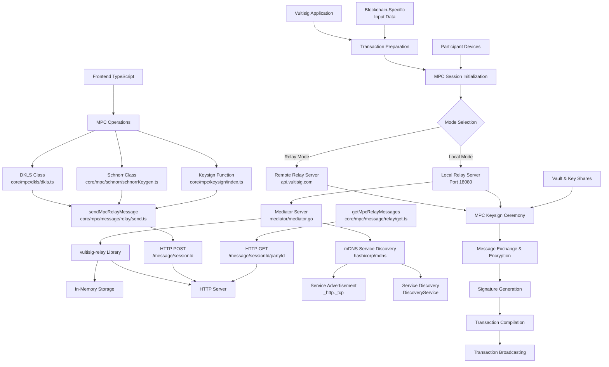

# Vultisig MPC Transaction Signing & Relay Server Specification

## Overview

This document provides a comprehensive specification for the Vultisig Multi-Party Computation (MPC) system, covering both the relay server infrastructure and the complete transaction signing workflow. The system enables secure, distributed transaction signing across multiple devices using threshold cryptography, supporting both local and remote relay modes for message coordination.

## System Architecture



# Part I: Relay Server Infrastructure

## 1. Core Relay Components

### 1.1 Mediator Server (`mediator/mediator.go`)

The mediator server is the core component that wraps the external `github.com/vultisig/vultisig-relay` library.

**Key Features:**
- Embedded HTTP server on port 18080
- In-memory storage for session management
- mDNS service advertisement for network discovery

**Implementation:**
```go
func NewRelayServer() (*Server, error) {
    store, err := storage.NewInMemoryStorage()
    if err != nil {
        return nil, err
    }
    s := server.NewServer(MediatorPort, store)
    return &Server{
        localServer: s,
    }, nil
}
```

**Methods:**
- `StartServer() error`: Starts the HTTP relay server
- `StopServer() error`: Cleanly shuts down the server
- `AdvertiseMediator(name string) error`: Advertises service via mDNS
- `DiscoveryService(name string) (string, error)`: Discovers other relay servers on the network

### 1.2 Session Management (`relay/session.go`)

Provides comprehensive session lifecycle management for MPC operations.

**Session Lifecycle:**
1. **Registration**: Parties register with their unique IDs
2. **Start**: Coordinator starts session when all parties join
3. **Message Exchange**: Encrypted MPC messages relayed between parties
4. **Completion**: Session completion tracking and cleanup

**Key Methods:**
- `StartSession(sessionID string, parties []string) error`: Initiates a new MPC session
- `RegisterSession(sessionID string, key string) error`: Registers a party in the session
- `WaitForSessionStart(ctx context.Context, sessionID string) ([]string, error)`: Waits for all parties to join
- `CompleteSession(sessionID, localPartyID string) error`: Marks session as complete
- `EndSession(sessionID string) error`: Terminates and cleans up session

### 1.3 Message Handling (`relay/messenger.go`)

Implements secure message transmission with encryption and integrity verification.

**Security Features:**
- AES-CBC encryption with PKCS7 padding
- MD5 hash for message integrity
- Sequence numbering to prevent replay attacks
- Base64 encoding for safe HTTP transport

**Message Structure:**
```go
type Message struct {
    SessionID  string   `json:"session_id"`
    From       string   `json:"from"`
    To         []string `json:"to"`
    Body       string   `json:"body"`       // Encrypted content
    Hash       string   `json:"hash"`       // MD5 hash for integrity
    SequenceNo int64    `json:"sequence_no"` // Anti-replay sequence
}
```

**Encryption Process:**
1. Encrypt message body using AES-CBC
2. Apply PKCS7 padding
3. Generate random IV
4. Base64 encode the result
5. Calculate MD5 hash for integrity

### 1.4 Service Discovery (mDNS)

The relay server implements Multicast DNS (mDNS) for automatic network discovery:

**Service Advertisement:**
- Service Type: `_http._tcp`
- Port: 18080
- Hostname: `{hostname}.local`
- Text Records: Service name for identification

**Discovery Process:**
1. Query for `_http._tcp` services
2. Filter by service name in text records
3. Extract IP address and port
4. Return connection string format: `{ip}:{port}`

**Benefits:**
- Zero-configuration networking
- Automatic discovery of local relay servers
- Fallback to remote relay servers when local unavailable

## 2. Server Configuration

### 2.1 Supported Server Types

```typescript
export const mpcServerTypes = ['relay', 'local'] as const
export const mpcServerUrl: Record<MpcServerType, string> = {
  relay: `${rootApiUrl}/router`,    // Remote relay server
  local: 'http://127.0.0.1:18080', // Local relay server
}
```

### 2.2 Runtime Configuration

- **Local Mode**: Uses embedded relay server (port 18080)
- **Remote Mode**: Connects to Vultisig's hosted relay service
- **Auto-Discovery**: Automatically discovers local servers via mDNS

## 3. HTTP API Reference

### 3.1 HTTP Endpoints

| Method | Endpoint | Description |
|--------|----------|-------------|
| POST | `/start/{sessionId}` | Start MPC session |
| GET | `/start/{sessionId}` | Check session start status |
| POST | `/{sessionId}` | Register party in session |
| GET | `/{sessionId}` | Get session parties |
| DELETE | `/{sessionId}` | End session |
| POST | `/message/{sessionId}` | Send MPC message |
| GET | `/message/{sessionId}/{partyId}` | Get messages for party |
| POST | `/complete/{sessionId}` | Mark session complete |
| GET | `/complete/{sessionId}` | Check completion status |
| POST | `/complete/{sessionId}/keysign` | Mark keysign complete |
| GET | `/complete/{sessionId}/keysign` | Check keysign status |

### 3.2 Go API Methods

**Mediator Server:**
- `NewRelayServer() (*Server, error)`
- `StartServer() error`
- `StopServer() error`
- `AdvertiseMediator(name string) error`
- `DiscoveryService(name string) (string, error)`

**Session Client:**
- `NewClient(vultisigRelay string) *Client`
- `StartSession(sessionID string, parties []string) error`
- `RegisterSession(sessionID string, key string) error`
- `WaitForSessionStart(ctx context.Context, sessionID string) ([]string, error)`
- `CompleteSession(sessionID, localPartyID string) error`
- `EndSession(sessionID string) error`

**Messenger:**
- `NewMessengerImp(server, sessionID, hexEncryptionKey string, messageID string) (*MessengerImp, error)`
- `Send(from, to, body string) error`

### 3.3 TypeScript API Functions

**Message Relay:**
- `sendMpcRelayMessage(input: SendMpcRelayMessageInput): Promise<void>`
- `getMpcRelayMessages(input: GetMpcRelayMessagesInput): Promise<MpcRelayMessage[]>`

**Message Encryption:**
- `toMpcServerMessage(body: Uint8Array, hexEncryptionKey: string): string`
- `fromMpcServerMessage(body: string, hexEncryptionKey: string): Buffer`

# Part II: Transaction Signing Workflow

## 4. Transaction Preparation

### 4.1 Transaction Input Data Generation

The first step involves preparing blockchain-specific transaction input data using the `getTxInputData` function:

```typescript
type TxPreparationInput = {
  keysignPayload: KeysignPayload
  walletCore: WalletCore
}

const inputs = getTxInputData({
  keysignPayload: payload,
  walletCore,
})
```

### 4.2 Blockchain-Specific Handlers

The system supports multiple blockchain types through dedicated handlers:

| Chain Kind | Handler | Description |
|------------|---------|-------------|
| `evm` | `getEvmTxInputData` | Ethereum-compatible chains |
| `utxo` | `getUtxoTxInputData` | Bitcoin-like UTXO chains |
| `cosmos` | `getCosmosTxInputData` | Cosmos SDK chains |
| `solana` | `getSolanaTxInputData` | Solana transactions |
| `polkadot` | `getPolkadotTxInputData` | Polkadot/Substrate chains |
| `cardano` | `getCardanoTxInputData` | Cardano transactions |
| `ton` | `getTonTxInputData` | TON blockchain |
| `sui` | `getSuiTxInputData` | Sui blockchain |
| `tron` | `getTronTxInputData` | TRON blockchain |
| `ripple` | `getRippleTxInputData` | XRP Ledger |

### 4.3 EVM Transaction Example

```typescript
// EVM transaction preparation
const evmTxInput = TW.Ethereum.Proto.SigningInput.create({
  toAddress: recipientAddress,
  transaction: TW.Ethereum.Proto.Transaction.create({
    transfer: TW.Ethereum.Proto.Transaction.Transfer.create({
      amount: toEvmTwAmount(amount),
      data: memo ? memoToTxData(memo) : undefined,
    }),
  }),
  chainId: getEvmTwChainId({ walletCore, chain }),
  nonce: getEvmTwNonce(nonce),
  maxFeePerGas: toEvmTwAmount(maxFeePerGasWei),
  maxPriorityFeePerGas: toEvmTwAmount(priorityFee),
  gasLimit: toEvmTwAmount(gasLimit),
})
```

### 4.4 UTXO Transaction Example

```typescript
// Bitcoin/UTXO transaction preparation
const utxoTxInput = TW.Bitcoin.Proto.SigningInput.create({
  hashType: walletCore.BitcoinScript.hashTypeForCoin(coinType),
  amount: Long.fromString(amount),
  useMaxAmount: sendMaxAmount,
  toAddress: destinationAddress,
  changeAddress: coin.address,
  byteFee: Long.fromString(byteFee),
  coinType: coinType.value,
  utxo: utxoInfo.map(({ hash, amount, index }) =>
    TW.Bitcoin.Proto.UnspentTransaction.create({
      amount: Long.fromString(amount.toString()),
      outPoint: TW.Bitcoin.Proto.OutPoint.create({
        hash: walletCore.HexCoding.decode(hash).reverse(),
        index: index,
        sequence: 0xffffffff,
      }),
      script: lockScript.data(),
    })
  ),
})
```

### 4.5 Pre-Signing Hash Generation

Once transaction input data is prepared, generate hashes for signing:

```typescript
const groupedMsgs = inputs.map(txInputData =>
  getPreSigningHashes({
    txInputData,
    walletCore,
    chain,
  }).map(value => Buffer.from(value).toString('hex'))
)

const msgs = groupedMsgs.flat().sort()
```

## 5. MPC Session Initialization

### 5.1 Session Parameters

Before starting the MPC ceremony, prepare session parameters:

```typescript
type SessionParams = {
  sessionId: string           // Unique session identifier
  localPartyId: string       // Local device identifier
  peers: string[]            // Other participant device IDs
  hexEncryptionKey: string   // Session encryption key
  serverUrl: string          // Relay server URL
  isInitiatingDevice: boolean // Whether this device initiates
}
```

### 5.2 Mode Selection

The system supports two operational modes:

#### 5.2.1 Relay Mode
Uses Vultisig's hosted relay service for message coordination:

```typescript
const relayModeConfig = {
  serverUrl: 'https://api.vultisig.com/router',
  mode: 'relay'
}
```

#### 5.2.2 Local Mode
Uses an embedded relay server running on port 18080:

```typescript
const localModeConfig = {
  serverUrl: 'http://127.0.0.1:18080',
  mode: 'local'
}
```

### 5.3 Session Lifecycle Implementation

#### 5.3.1 Session Registration

Each participant registers with the session:

```go
// Go implementation
func (s *Client) RegisterSession(sessionID string, key string) error {
    sessionURL := s.vultisigRelay + "/" + sessionID
    buf, err := json.Marshal([]string{key})
    if err != nil {
        return fmt.Errorf("fail to register session: %w", err)
    }
    resp, err := s.client.Post(sessionURL, "application/json", bytes.NewBuffer(buf))
    if err != nil {
        return fmt.Errorf("fail to register session: %w", err)
    }
    defer s.closer(resp.Body)
    if resp.StatusCode != http.StatusCreated {
        return fmt.Errorf("fail to register session: %s", resp.Status)
    }
    return nil
}
```

```typescript
// TypeScript implementation
const joinMpcSession = async ({
  serverUrl,
  sessionId,
  localPartyId,
}: JoinMpcSessionInput) => {
  const response = await fetch(`${serverUrl}/${sessionId}`, {
    method: 'POST',
    body: localPartyId,
  })
  
  if (!response.ok) {
    throw new Error(`Failed to join session: ${response.statusText}`)
  }
}
```

#### 5.3.2 Session Start

The initiating device starts the session with participant list:

```go
func (s *Client) StartSession(sessionID string, parties []string) error {
    sessionURL := s.vultisigRelay + "/start/" + sessionID
    body, err := json.Marshal(parties)
    if err != nil {
        return fmt.Errorf("fail to start session: %w", err)
    }
    
    req, err := http.NewRequest(http.MethodPost, sessionURL, bytes.NewBuffer(body))
    req.Header.Set("Content-Type", "application/json")
    resp, err := s.client.Do(req)
    if err != nil {
        return fmt.Errorf("fail to start session: %w", err)
    }
    defer s.closer(resp.Body)
    if resp.StatusCode != http.StatusOK {
        return fmt.Errorf("fail to start session: %s", resp.Status)
    }
    return nil
}
```

#### 5.3.3 Wait for Session Start

All participants wait for session to begin:

```go
func (s *Client) WaitForSessionStart(ctx context.Context, sessionID string) ([]string, error) {
    sessionURL := s.vultisigRelay + "/start/" + sessionID
    for {
        select {
        case <-ctx.Done():
            return nil, ctx.Err()
        default:
            resp, err := s.client.Get(sessionURL)
            if err != nil {
                return nil, fmt.Errorf("fail to get session: %w", err)
            }
            if resp.StatusCode != http.StatusOK {
                return nil, fmt.Errorf("fail to get session: %s", resp.Status)
            }
            
            var parties []string
            buff, err := io.ReadAll(resp.Body)
            if err != nil {
                return nil, fmt.Errorf("fail to read session body: %w", err)
            }
            if err := resp.Body.Close(); err != nil {
                s.Logger.Errorf("fail to close response body, %w", err)
            }
            if err := json.Unmarshal(buff, &parties); err != nil {
                return nil, fmt.Errorf("fail to unmarshal session body: %w", err)
            }
            
            // Session starts when we have multiple parties
            if len(parties) > 1 {
                return parties, nil
            }
            
            time.Sleep(1 * time.Second) // Backoff
        }
    }
}
```

## 6. MPC Keysign Ceremony

### 6.1 Ceremony Initialization

Once the session is established, initialize the MPC keysign ceremony:

```typescript
const keysignResult = await keysign({
  keyShare,                    // Vault key share
  signatureAlgorithm,         // 'ecdsa' or 'eddsa'
  message,                    // Hash to sign (hex string)
  chainPath,                  // Derivation path
  localPartyId,               // Local device ID
  peers,                      // Other participants
  serverUrl,                  // Relay server URL
  sessionId,                  // Session identifier
  hexEncryptionKey,           // Encryption key
  isInitiatingDevice,         // Initiator flag
})
```

### 6.2 Setup Message Verification

The system ensures setup message integrity:

```typescript
const setupMessage = await ensureSetupMessage({
  keyShare,
  signatureAlgorithm,
  message,
  chainPath,
  devices: [localPartyId, ...peers],
  serverUrl,
  sessionId,
  hexEncryptionKey,
  isInitiatingDevice,
})

const setupMessageHash = SignSession[signatureAlgorithm].setupMessageHash(setupMessage)

if (message !== Buffer.from(setupMessageHash).toString('hex')) {
  throw new Error('Setup message hash does not match the original message')
}
```

### 6.3 MPC Message Exchange

#### 6.3.1 Outbound Message Processing

```typescript
const processOutbound = async (sequenceNo = 0): Promise<void> => {
  const message = session.outputMessage()
  if (!message) {
    await sleep(100)
    return processOutbound(sequenceNo)
  }

  const { body, receivers } = message
  const messageToSend = toMpcServerMessage(body, hexEncryptionKey)

  await chainPromises(
    receivers.map((receiver, index) => () =>
      sendMpcRelayMessage({
        serverUrl,
        sessionId,
        message: {
          session_id: sessionId,
          from: localPartyId,
          to: [receiver],
          body: messageToSend,
          hash: getMessageHash(base64Encode(body)),
          sequence_no: sequenceNo + index,
        },
        messageId,
      })
    )
  )

  return processOutbound(sequenceNo + receivers.length)
}
```

#### 6.3.2 Inbound Message Processing

```typescript
const processInbound = async (): Promise<void> => {
  if (abortController.signal.aborted) {
    throw new Error(`Exited inbound processing due to timeout`)
  }

  const relayMessages = await getMpcRelayMessages({
    serverUrl,
    localPartyId,
    sessionId,
    messageId,
  })

  for (const msg of relayMessages) {
    if (session.inputMessage(fromMpcServerMessage(msg.body, hexEncryptionKey))) {
      return // Session complete
    }
    
    // Clean up processed message
    await deleteMpcRelayMessage({
      serverUrl,
      localPartyId,
      sessionId,
      messageHash: msg.hash,
      messageId,
    })
  }

  return processInbound()
}
```

### 6.4 Go Implementation (Backend)

The Go backend provides TSS (Threshold Signature Scheme) services:

```go
func (t *TssService) Keysign(
    vault storage.Vault,
    messages []string,
    localPartyID string,
    derivePath string,
    sessionID, hexEncryptionKey, serverURL, tssType string,
) ([]*mtss.KeysignResponse, error) {
    // Sort messages for consistency
    slices.Sort(messages)
    
    // Create relay client
    client := relay.NewClient(serverURL)
    
    // Wait for session start
    ctx, cancel := context.WithTimeout(context.Background(), time.Minute)
    defer cancel()
    partiesJoined, err := client.WaitForSessionStart(ctx, sessionID)
    if err != nil {
        return nil, fmt.Errorf("failed to wait for session start: %w", err)
    }
    
    // Validate participants
    for _, party := range partiesJoined {
        if !slices.Contains(vault.Signers, party) {
            return nil, fmt.Errorf("device %s not in vault signers", party)
        }
    }
    
    // Create local state accessor
    vaultShares := make(map[string]string)
    for _, item := range vault.KeyShares {
        vaultShares[item.PublicKey] = item.KeyShare
    }
    localStateAccessor, err := NewLocalStateAccessorImp(vaultShares)
    if err != nil {
        return nil, fmt.Errorf("failed to create localStateAccessor: %w", err)
    }
    
    // Sign each message
    var result []*mtss.KeysignResponse
    for _, msg := range messages {
        resp, err := t.keysignWithRetry(vault, partiesJoined, msg, 
            localPartyID, tssType, derivePath, sessionID, 
            hexEncryptionKey, serverURL, localStateAccessor)
        if err != nil {
            return nil, fmt.Errorf("failed to keysign: %w", err)
        }
        result = append(result, resp)
    }
    
    return result, nil
}
```

### 6.5 Signature Generation

After successful MPC ceremony, extract the signature:

```typescript
const signature = session.finish()
const [rawR, rawS] = [signature.slice(0, 32), signature.slice(32, 64)]
const [r, s] = [rawR, rawS]
  .map(value => Buffer.from(value))
  .map(value =>
    match(signatureAlgorithm, {
      ecdsa: () => value,
      eddsa: () => value.reverse(),
    })
  )
  .map(value => value.toString('hex'))

const derSignature = encodeDERSignature(rawR, rawS)
```

## 7. Transaction Compilation

### 7.1 Signature Integration

Compile the transaction with generated signatures:

```typescript
const compiledTxs = inputs.map(txInputData =>
  compileTx({
    walletCore,
    txInputData,
    chain,
    publicKey,
    signatures: signaturesRecord,
  })
)
```

### 7.2 Compilation Process

The compilation process involves:

1. **Hash Verification**: Verify pre-signing hashes
2. **Signature Generation**: Format signatures for blockchain
3. **Signature Assertion**: Validate signatures against public key
4. **Transaction Assembly**: Combine all components

```typescript
export const compileTx = ({
  publicKey,
  txInputData,
  signatures,
  chain,
  walletCore,
}: CompileTxInput) => {
  const hashes = getPreSigningHashes({
    walletCore,
    txInputData,
    chain,
  })

  const allSignatures = walletCore.DataVector.create()
  const publicKeys = walletCore.DataVector.create()

  hashes.forEach(hash => {
    const chainKind = getChainKind(chain)
    const signatureFormat = signatureFormats[chainKind]

    const signature = generateSignature({
      walletCore,
      signature: signatures[Buffer.from(hash).toString('hex')],
      signatureFormat,
    })

    assertSignature({
      publicKey,
      message: hash,
      signature,
      signatureFormat,
    })

    allSignatures.add(signature)

    if (chainKind !== 'evm') {
      publicKeys.add(publicKey.data())
    }
  })

  const coinType = getCoinType({ chain, walletCore })

  return walletCore.TransactionCompiler.compileWithSignatures(
    coinType,
    txInputData,
    allSignatures,
    publicKeys
  )
}
```

### 7.3 Transaction Hash Generation

Generate transaction hash for tracking:

```typescript
const txs: Tx[] = await Promise.all(
  compiledTxs.map(async compiledTx => {
    const tx = decodeTx({ chain, compiledTx })
    const hash = await getTxHash({ chain, tx })

    return {
      ...tx,
      hash,
    }
  })
)
```

## 8. Transaction Broadcasting

### 8.1 Broadcasting Process

After successful compilation, broadcast transactions to the blockchain:

```typescript
if (!payload.skipBroadcast) {
  await chainPromises(
    txs.map(tx => () => broadcastTx({ chain, tx }))
  )
}
```

### 8.2 Blockchain-Specific Broadcasting

The system supports broadcasting to multiple blockchain types:

```typescript
const handlers: Record<ChainKind, BroadcastTxResolver<any>> = {
  cardano: broadcastUtxoTx,
  cosmos: broadcastCosmosTx,
  evm: broadcastEvmTx,
  polkadot: broadcastPolkadotTx,
  ripple: broadcastRippleTx,
  solana: broadcastSolanaTx,
  sui: broadcastSuiTx,
  ton: broadcastTonTx,
  utxo: broadcastUtxoTx,
  tron: broadcastTronTx,
}

export const broadcastTx: BroadcastTxResolver = input =>
  handlers[getChainKind(input.chain)](input)
```

## 9. Security Implementation

### 9.1 Message Encryption

All MPC messages are encrypted using AES encryption:

**TypeScript (AES-GCM):**
```typescript
export const toMpcServerMessage = (
  body: Uint8Array,
  hexEncryptionKey: string
) =>
  encryptWithAesGcm({
    key: Buffer.from(hexEncryptionKey, 'hex'),
    value: Buffer.from(base64Encode(body)),
  }).toString(encryptedEncoding)
```

**Go (AES-CBC):**
```go
func encrypt(plainText, hexKey string) (string, error) {
    key, err := hex.DecodeString(hexKey)
    if err != nil {
        return "", err
    }
    plainByte := []byte(plainText)
    block, err := aes.NewCipher(key)
    if err != nil {
        return "", err
    }
    plainByte = pad(plainByte, aes.BlockSize)
    iv := make([]byte, aes.BlockSize)
    if _, err := io.ReadFull(rand.Reader, iv); err != nil {
        return "", err
    }
    mode := cipher.NewCBCEncrypter(block, iv)
    ciphertext := make([]byte, len(plainByte))
    mode.CryptBlocks(ciphertext, plainByte)
    ciphertext = append(iv, ciphertext...)
    return string(ciphertext), nil
}

// pad applies PKCS7 padding to the plaintext
func pad(data []byte, blockSize int) []byte {
    padding := blockSize - len(data)%blockSize
    padtext := bytes.Repeat([]byte{byte(padding)}, padding)
    return append(data, padtext...)
}
```

### 9.2 Security Features

**Session Isolation:**
- Each session has a unique session ID
- Messages are scoped to specific sessions
- Encryption keys are session-specific
- Participants are validated per session

**Message Integrity:**
- MD5 hashes verify message integrity
- Sequence numbers prevent replay attacks
- From/To fields ensure proper routing
- Session boundaries prevent cross-contamination

**Encryption Standards:**

*Go Side (relay/messenger.go):*
- Algorithm: AES-CBC
- Padding: PKCS7
- Key Format: Hex-encoded
- IV: Random 16-byte initialization vector

*TypeScript Side (core/mpc/message/server.ts):*
- Algorithm: AES-GCM
- Key Format: Hex-encoded
- Authentication: Built-in AEAD

## 10. Local vs Relay Mode Comparison

### 10.1 Local Mode

**Characteristics:**
- Uses embedded relay server on port 18080
- Direct peer-to-peer communication
- No external dependencies
- Requires network connectivity between participants
- Uses mDNS for service discovery

**Configuration:**
```typescript
const localConfig = {
  serverUrl: 'http://127.0.0.1:18080',
  mode: 'local' as const
}
```

**Benefits:**
- Lower latency
- No external server dependency
- Enhanced privacy
- Direct device communication

### 10.2 Relay Mode

**Characteristics:**
- Uses Vultisig's hosted relay service
- Messages routed through central server
- Works across different networks
- Requires internet connectivity

**Configuration:**
```typescript
const relayConfig = {
  serverUrl: 'https://api.vultisig.com/router',
  mode: 'relay' as const
}
```

**Benefits:**
- Works across NAT/firewall boundaries
- No local server setup required
- Reliable message delivery
- Cross-network compatibility

### 10.3 Mode Selection Logic

```typescript
const selectMode = (preferences: UserPreferences): MpcServerType => {
  if (preferences.preferLocal && isLocalServerAvailable()) {
    return 'local'
  }
  return 'relay'
}
```

## 11. Error Handling & Recovery

### 11.1 Common Error Scenarios

1. **Network Connectivity Issues**
   - Timeout handling with configurable limits
   - Retry logic with exponential backoff
   - Fallback between local and relay modes

2. **Session Management Errors**
   - Invalid session states
   - Participant validation failures
   - Session timeout handling

3. **Cryptographic Errors**
   - Key validation failures
   - Signature verification errors
   - Encryption/decryption failures

4. **Blockchain-Specific Errors**
   - Invalid transaction format
   - Insufficient fees
   - Network congestion

### 11.2 Error Recovery Implementation

```typescript
const { error } = await attempt(processInbound())
if (error) {
  // Log error details
  console.error('MPC ceremony failed:', error)
  
  // Clean up resources
  abortController.abort()
  clearTimeout(timeout)
  
  // Propagate error
  throw error
}
```

### 11.3 Retry Logic

The Go implementation includes retry logic for failed operations:

```go
for attempt := 0; attempt < 3; attempt++ {
    if t.isEdDSA(tssType) {
        resp, err = tssServerImp.KeysignEdDSA(req)
    } else {
        resp, err = tssServerImp.KeysignECDSA(req)
    }
    if err == nil {
        // Mark keysign complete
        if err := client.MarkKeysignComplete(sessionID, messageID, *resp); err != nil {
            t.Logger.Error("Failed to mark keysign complete")
        }
        break
    }
    
    // Check if other party already completed
    sigResp, checkErr := client.CheckKeysignComplete(sessionID, messageID)
    if checkErr == nil && sigResp != nil {
        t.Logger.Info("Other party already got signature")
        resp = sigResp
        break
    }
}
```

## 12. Performance Considerations

### 12.1 Timeouts

- **Keysign Timeout**: 1 minute for inbound message processing
- **Session Start**: 1 minute for session establishment
- **Keygen Timeout**: 5 minutes for key generation

### 12.2 Message Processing

- **Batch Processing**: Multiple signatures in single ceremony
- **Parallel Processing**: Concurrent message handling
- **Resource Management**: Proper cleanup of completed sessions

### 12.3 Optimization

- **Connection Pooling**: Reuse HTTP connections
- **Message Batching**: Group related operations
- **Efficient Encoding**: Use compact message formats

### 12.4 Scalability

- **In-Memory Storage**: Fast but limited by available RAM
- **Concurrent Sessions**: Multiple MPC sessions supported simultaneously
- **Message Throughput**: Optimized for small, frequent MPC messages

## 13. Integration Examples

### 13.1 Complete Transaction Signing Flow

```typescript
async function signTransaction(
  keysignPayload: KeysignPayload,
  sessionConfig: SessionConfig
): Promise<SignedTransaction> {
  // 1. Prepare transaction
  const inputs = getTxInputData({
    keysignPayload,
    walletCore,
  })
  
  // 2. Generate pre-signing hashes
  const msgs = inputs
    .flatMap(txInputData =>
      getPreSigningHashes({ txInputData, walletCore, chain })
        .map(value => Buffer.from(value).toString('hex'))
    )
    .sort()
  
  // 3. Initialize MPC session
  const signatures = await keysignAction({
    msgs,
    signatureAlgorithm,
    coinType,
  })
  
  // 4. Compile transaction
  const compiledTxs = inputs.map(txInputData =>
    compileTx({
      walletCore,
      txInputData,
      chain,
      publicKey,
      signatures: recordFromItems(signatures, ({ msg }) =>
        Buffer.from(msg, 'base64').toString('hex')
      ),
    })
  )
  
  // 5. Generate transaction hash
  const txs = await Promise.all(
    compiledTxs.map(async compiledTx => {
      const tx = decodeTx({ chain, compiledTx })
      const hash = await getTxHash({ chain, tx })
      return { ...tx, hash }
    })
  )
  
  // 6. Broadcast transaction
  if (!keysignPayload.skipBroadcast) {
    await chainPromises(
      txs.map(tx => () => broadcastTx({ chain, tx }))
    )
  }
  
  return { txs }
}
```

### 13.2 Custom Message Signing

```typescript
async function signCustomMessage(
  message: string,
  chain: CustomMessageSupportedChain
): Promise<string> {
  const chainKind = getChainKind(chain)
  const messageToHash = message.startsWith('0x')
    ? Buffer.from(message.slice(2), 'hex')
    : message

  const signingType: SigningType = chainSigningType[chain]
  const messageBytes = typeof messageToHash === 'string'
    ? new TextEncoder().encode(messageToHash)
    : messageToHash

  const hexMessage = match(signingType, {
    EIP191: () => keccak256(messageBytes),
    RAW_BYTES: () => Buffer.from(messageBytes).toString('hex'),
  })

  const [signature] = await keysignAction({
    msgs: [hexMessage],
    signatureAlgorithm: signatureAlgorithms[chainKind],
    coinType: getCoinType({ walletCore, chain }),
  })

  const result = generateSignature({
    walletCore,
    signature,
    signatureFormat: signatureFormats[chainKind],
  })

  return Buffer.from(result).toString('hex')
}
```

## 14. Dependencies & Requirements

### 14.1 External Libraries

**Go Dependencies:**
- `github.com/vultisig/vultisig-relay`: Core relay server implementation
- `github.com/hashicorp/mdns`: mDNS service discovery
- `github.com/sirupsen/logrus`: Structured logging
- `github.com/wailsapp/wails/v2`: Desktop application framework

**TypeScript Dependencies:**
- Custom encryption utilities for AES-GCM
- HTTP client utilities for API communication
- MPC protocol implementations (DKLS, Schnorr)

### 14.2 System Requirements

- **Port 18080**: Must be available for local relay server
- **Network Connectivity**: Required for both local and remote modes
- **mDNS Support**: For automatic service discovery in local mode
- **Firewall Configuration**: Allow HTTP traffic on port 18080

## 15. Troubleshooting Guide

### 15.1 Common Issues

1. **Port Conflicts**: Ensure port 18080 is available
2. **Firewall**: Configure firewall to allow mDNS and HTTP traffic
3. **Network Discovery**: Verify mDNS is working on the network
4. **Encryption Keys**: Ensure all parties use the same encryption key
5. **Session Timeouts**: Adjust timeout values for slow networks

### 15.2 Debug Information

- **Logs**: Check application logs for error messages
- **Network**: Verify network connectivity between parties
- **Sessions**: Monitor session state transitions
- **Messages**: Validate message format and encryption

### 15.3 Error Response Codes

- `200 OK`: Successful operation
- `201 Created`: Session created successfully
- `202 Accepted`: Message accepted for relay
- `400 Bad Request`: Invalid request format
- `404 Not Found`: Session or message not found
- `500 Internal Server Error`: Server-side error

## 16. Best Practices

### 16.1 Security

1. **Key Management**: Use cryptographically secure random keys
2. **Session Isolation**: Ensure messages cannot cross session boundaries
3. **Encryption**: Always encrypt sensitive MPC data
4. **Integrity**: Verify message hashes before processing

### 16.2 Reliability

1. **Error Handling**: Implement comprehensive error handling
2. **Timeouts**: Use appropriate timeouts for network operations
3. **Retry Logic**: Implement exponential backoff for failed requests
4. **Cleanup**: Ensure proper resource cleanup on errors

### 16.3 Development

1. **Logging**: Use structured logging for debugging
2. **Testing**: Implement unit and integration tests
3. **Monitoring**: Add metrics for session success/failure rates
4. **Documentation**: Keep API documentation up to date

## 17. Conclusion

This comprehensive specification provides a complete guide for implementing transaction signing using Vultisig's MPC infrastructure. The system integrates a sophisticated relay server with a robust transaction signing workflow, supporting both local and remote relay modes, multiple blockchain types, and comprehensive security features.

**Key System Features:**

1. **Dual-Mode Operation**: Seamless switching between local and relay modes
2. **Multi-Blockchain Support**: Comprehensive support for 10+ blockchain ecosystems
3. **Secure Communication**: End-to-end encryption with message integrity verification
4. **Service Discovery**: Automatic network discovery via mDNS
5. **Robust Error Handling**: Comprehensive error recovery and retry mechanisms
6. **Scalable Architecture**: Support for concurrent sessions and multiple participants

**Implementation Highlights:**

- **Transaction Preparation**: Blockchain-specific handlers for transaction input data
- **Session Management**: Complete lifecycle management with participant coordination
- **MPC Ceremony**: Secure message exchange for threshold signing
- **Relay Infrastructure**: Embedded HTTP server with in-memory storage
- **Security**: Multiple encryption layers with session isolation
- **Broadcasting**: Reliable transaction submission to target blockchains

The system is designed to be extensible, secure, and efficient, supporting the growing needs of multi-party wallet applications in the blockchain ecosystem while maintaining high standards for security, reliability, and performance.