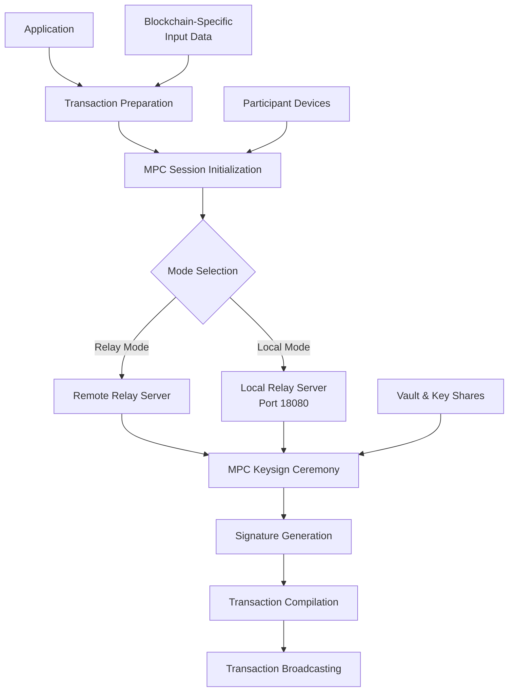

# Transaction Signing Specification for Vultisig CLI

## Overview

This document provides a comprehensive specification for how applications can prepare transactions, invoke the MPC (Multi-Party Computation) engine, start sessions in both relay and local modes, conduct the MPC keysign ceremony, and broadcast transactions in the Vultisig ecosystem.

## Architecture Overview



## 1. Transaction Preparation

### 1.1 Transaction Input Data Generation

The first step involves preparing blockchain-specific transaction input data using the `getTxInputData` function:

```typescript
type TxPreparationInput = {
  keysignPayload: KeysignPayload
  walletCore: WalletCore
}

const inputs = getTxInputData({
  keysignPayload: payload,
  walletCore,
})
```

### 1.2 Blockchain-Specific Handlers

The system supports multiple blockchain types through dedicated handlers:

| Chain Kind | Handler | Description |
|------------|---------|-------------|
| `evm` | `getEvmTxInputData` | Ethereum-compatible chains |
| `utxo` | `getUtxoTxInputData` | Bitcoin-like UTXO chains |
| `cosmos` | `getCosmosTxInputData` | Cosmos SDK chains |
| `solana` | `getSolanaTxInputData` | Solana transactions |
| `polkadot` | `getPolkadotTxInputData` | Polkadot/Substrate chains |
| `cardano` | `getCardanoTxInputData` | Cardano transactions |
| `ton` | `getTonTxInputData` | TON blockchain |
| `sui` | `getSuiTxInputData` | Sui blockchain |
| `tron` | `getTronTxInputData` | TRON blockchain |
| `ripple` | `getRippleTxInputData` | XRP Ledger |

### 1.3 EVM Transaction Example

```typescript
// EVM transaction preparation
const evmTxInput = TW.Ethereum.Proto.SigningInput.create({
  toAddress: recipientAddress,
  transaction: TW.Ethereum.Proto.Transaction.create({
    transfer: TW.Ethereum.Proto.Transaction.Transfer.create({
      amount: toEvmTwAmount(amount),
      data: memo ? memoToTxData(memo) : undefined,
    }),
  }),
  chainId: getEvmTwChainId({ walletCore, chain }),
  nonce: getEvmTwNonce(nonce),
  maxFeePerGas: toEvmTwAmount(maxFeePerGasWei),
  maxPriorityFeePerGas: toEvmTwAmount(priorityFee),
  gasLimit: toEvmTwAmount(gasLimit),
})
```

### 1.4 UTXO Transaction Example

```typescript
// Bitcoin/UTXO transaction preparation
const utxoTxInput = TW.Bitcoin.Proto.SigningInput.create({
  hashType: walletCore.BitcoinScript.hashTypeForCoin(coinType),
  amount: Long.fromString(amount),
  useMaxAmount: sendMaxAmount,
  toAddress: destinationAddress,
  changeAddress: coin.address,
  byteFee: Long.fromString(byteFee),
  coinType: coinType.value,
  utxo: utxoInfo.map(({ hash, amount, index }) =>
    TW.Bitcoin.Proto.UnspentTransaction.create({
      amount: Long.fromString(amount.toString()),
      outPoint: TW.Bitcoin.Proto.OutPoint.create({
        hash: walletCore.HexCoding.decode(hash).reverse(),
        index: index,
        sequence: 0xffffffff,
      }),
      script: lockScript.data(),
    })
  ),
})
```

### 1.5 Pre-Signing Hash Generation

Once transaction input data is prepared, generate hashes for signing:

```typescript
const groupedMsgs = inputs.map(txInputData =>
  getPreSigningHashes({
    txInputData,
    walletCore,
    chain,
  }).map(value => Buffer.from(value).toString('hex'))
)

const msgs = groupedMsgs.flat().sort()
```

## 2. MPC Session Initialization

### 2.1 Session Parameters

Before starting the MPC ceremony, prepare session parameters:

```typescript
type SessionParams = {
  sessionId: string           // Unique session identifier
  localPartyId: string       // Local device identifier
  peers: string[]            // Other participant device IDs
  hexEncryptionKey: string   // Session encryption key
  serverUrl: string          // Relay server URL
  isInitiatingDevice: boolean // Whether this device initiates
}
```

### 2.2 Mode Selection

The system supports two operational modes:

#### 2.2.1 Relay Mode
Uses Vultisig's hosted relay service for message coordination:

```typescript
const relayModeConfig = {
  serverUrl: 'https://api.vultisig.com/router',
  mode: 'relay'
}
```

#### 2.2.2 Local Mode
Uses an embedded relay server running on port 18080:

```typescript
const localModeConfig = {
  serverUrl: 'http://127.0.0.1:18080',
  mode: 'local'
}
```

### 2.3 Session Lifecycle

#### 2.3.1 Session Registration

Each participant registers with the session:

```go
// Go implementation
func (s *Client) RegisterSession(sessionID string, key string) error {
    sessionURL := s.vultisigRelay + "/" + sessionID
    req, err := http.NewRequest(http.MethodPost, sessionURL, strings.NewReader(key))
    if err != nil {
        return fmt.Errorf("fail to register session: %w", err)
    }
    // ... handle response
}
```

```typescript
// TypeScript implementation
const joinMpcSession = async ({
  serverUrl,
  sessionId,
  localPartyId,
}: JoinMpcSessionInput) => {
  const response = await fetch(`${serverUrl}/${sessionId}`, {
    method: 'POST',
    body: localPartyId,
  })
  
  if (!response.ok) {
    throw new Error(`Failed to join session: ${response.statusText}`)
  }
}
```

#### 2.3.2 Session Start

The initiating device starts the session with participant list:

```go
func (s *Client) StartSession(sessionID string, parties []string) error {
    sessionURL := s.vultisigRelay + "/start/" + sessionID
    body, err := json.Marshal(parties)
    if err != nil {
        return fmt.Errorf("fail to start session: %w", err)
    }
    
    req, err := http.NewRequest(http.MethodPost, sessionURL, bytes.NewBuffer(body))
    req.Header.Set("Content-Type", "application/json")
    // ... handle response
}
```

#### 2.3.3 Wait for Session Start

All participants wait for session to begin:

```go
func (s *Client) WaitForSessionStart(ctx context.Context, sessionID string) ([]string, error) {
    sessionURL := s.vultisigRelay + "/start/" + sessionID
    for {
        select {
        case <-ctx.Done():
            return nil, ctx.Err()
        default:
            resp, err := s.client.Get(sessionURL)
            if err != nil {
                return nil, fmt.Errorf("fail to get session: %w", err)
            }
            
            var parties []string
            // ... parse response
            
            // Session starts when we have multiple parties
            if len(parties) > 1 {
                return parties, nil
            }
            
            time.Sleep(1 * time.Second) // Backoff
        }
    }
}
```

## 3. MPC Keysign Ceremony

### 3.1 Ceremony Initialization

Once the session is established, initialize the MPC keysign ceremony:

```typescript
const keysignResult = await keysign({
  keyShare,                    // Vault key share
  signatureAlgorithm,         // 'ecdsa' or 'eddsa'
  message,                    // Hash to sign (hex string)
  chainPath,                  // Derivation path
  localPartyId,               // Local device ID
  peers,                      // Other participants
  serverUrl,                  // Relay server URL
  sessionId,                  // Session identifier
  hexEncryptionKey,           // Encryption key
  isInitiatingDevice,         // Initiator flag
})
```

### 3.2 Setup Message Verification

The system ensures setup message integrity:

```typescript
const setupMessage = await ensureSetupMessage({
  keyShare,
  signatureAlgorithm,
  message,
  chainPath,
  devices: [localPartyId, ...peers],
  serverUrl,
  sessionId,
  hexEncryptionKey,
  isInitiatingDevice,
})

const setupMessageHash = SignSession[signatureAlgorithm].setupMessageHash(setupMessage)

if (message !== Buffer.from(setupMessageHash).toString('hex')) {
  throw new Error('Setup message hash does not match the original message')
}
```

### 3.3 MPC Message Exchange

#### 3.3.1 Outbound Message Processing

```typescript
const processOutbound = async (sequenceNo = 0): Promise<void> => {
  const message = session.outputMessage()
  if (!message) {
    await sleep(100)
    return processOutbound(sequenceNo)
  }

  const { body, receivers } = message
  const messageToSend = toMpcServerMessage(body, hexEncryptionKey)

  await chainPromises(
    receivers.map((receiver, index) => () =>
      sendMpcRelayMessage({
        serverUrl,
        sessionId,
        message: {
          session_id: sessionId,
          from: localPartyId,
          to: [receiver],
          body: messageToSend,
          hash: getMessageHash(base64Encode(body)),
          sequence_no: sequenceNo + index,
        },
        messageId,
      })
    )
  )

  return processOutbound(sequenceNo + receivers.length)
}
```

#### 3.3.2 Inbound Message Processing

```typescript
const processInbound = async (): Promise<void> => {
  if (abortController.signal.aborted) {
    throw new Error(`Exited inbound processing due to timeout`)
  }

  const relayMessages = await getMpcRelayMessages({
    serverUrl,
    localPartyId,
    sessionId,
    messageId,
  })

  for (const msg of relayMessages) {
    if (session.inputMessage(fromMpcServerMessage(msg.body, hexEncryptionKey))) {
      return // Session complete
    }
    
    // Clean up processed message
    await deleteMpcRelayMessage({
      serverUrl,
      localPartyId,
      sessionId,
      messageHash: msg.hash,
      messageId,
    })
  }

  return processInbound()
}
```

### 3.4 Go Implementation (Backend)

The Go backend provides TSS (Threshold Signature Scheme) services:

```go
func (t *TssService) Keysign(
    vault storage.Vault,
    messages []string,
    localPartyID string,
    derivePath string,
    sessionID, hexEncryptionKey, serverURL, tssType string,
) ([]*mtss.KeysignResponse, error) {
    // Sort messages for consistency
    slices.Sort(messages)
    
    // Create relay client
    client := relay.NewClient(serverURL)
    
    // Wait for session start
    ctx, cancel := context.WithTimeout(context.Background(), time.Minute)
    defer cancel()
    partiesJoined, err := client.WaitForSessionStart(ctx, sessionID)
    if err != nil {
        return nil, fmt.Errorf("failed to wait for session start: %w", err)
    }
    
    // Validate participants
    for _, party := range partiesJoined {
        if !slices.Contains(vault.Signers, party) {
            return nil, fmt.Errorf("device %s not in vault signers", party)
        }
    }
    
    // Create local state accessor
    vaultShares := make(map[string]string)
    for _, item := range vault.KeyShares {
        vaultShares[item.PublicKey] = item.KeyShare
    }
    localStateAccessor, err := NewLocalStateAccessorImp(vaultShares)
    if err != nil {
        return nil, fmt.Errorf("failed to create localStateAccessor: %w", err)
    }
    
    // Sign each message
    var result []*mtss.KeysignResponse
    for _, msg := range messages {
        resp, err := t.keysignWithRetry(vault, partiesJoined, msg, 
            localPartyID, tssType, derivePath, sessionID, 
            hexEncryptionKey, serverURL, localStateAccessor)
        if err != nil {
            return nil, fmt.Errorf("failed to keysign: %w", err)
        }
        result = append(result, resp)
    }
    
    return result, nil
}
```

### 3.5 Signature Generation

After successful MPC ceremony, extract the signature:

```typescript
const signature = session.finish()
const [rawR, rawS] = [signature.slice(0, 32), signature.slice(32, 64)]
const [r, s] = [rawR, rawS]
  .map(value => Buffer.from(value))
  .map(value =>
    match(signatureAlgorithm, {
      ecdsa: () => value,
      eddsa: () => value.reverse(),
    })
  )
  .map(value => value.toString('hex'))

const derSignature = encodeDERSignature(rawR, rawS)
```

## 4. Transaction Compilation

### 4.1 Signature Integration

Compile the transaction with generated signatures:

```typescript
const compiledTxs = inputs.map(txInputData =>
  compileTx({
    walletCore,
    txInputData,
    chain,
    publicKey,
    signatures: signaturesRecord,
  })
)
```

### 4.2 Compilation Process

The compilation process involves:

1. **Hash Verification**: Verify pre-signing hashes
2. **Signature Generation**: Format signatures for blockchain
3. **Signature Assertion**: Validate signatures against public key
4. **Transaction Assembly**: Combine all components

```typescript
export const compileTx = ({
  publicKey,
  txInputData,
  signatures,
  chain,
  walletCore,
}: CompileTxInput) => {
  const hashes = getPreSigningHashes({
    walletCore,
    txInputData,
    chain,
  })

  const allSignatures = walletCore.DataVector.create()
  const publicKeys = walletCore.DataVector.create()

  hashes.forEach(hash => {
    const chainKind = getChainKind(chain)
    const signatureFormat = signatureFormats[chainKind]

    const signature = generateSignature({
      walletCore,
      signature: signatures[Buffer.from(hash).toString('hex')],
      signatureFormat,
    })

    assertSignature({
      publicKey,
      message: hash,
      signature,
      signatureFormat,
    })

    allSignatures.add(signature)

    if (chainKind !== 'evm') {
      publicKeys.add(publicKey.data())
    }
  })

  const coinType = getCoinType({ chain, walletCore })

  return walletCore.TransactionCompiler.compileWithSignatures(
    coinType,
    txInputData,
    allSignatures,
    publicKeys
  )
}
```

### 4.3 Transaction Hash Generation

Generate transaction hash for tracking:

```typescript
const txs: Tx[] = await Promise.all(
  compiledTxs.map(async compiledTx => {
    const tx = decodeTx({ chain, compiledTx })
    const hash = await getTxHash({ chain, tx })

    return {
      ...tx,
      hash,
    }
  })
)
```

## 5. Transaction Broadcasting

### 5.1 Broadcasting Process

After successful compilation, broadcast transactions to the blockchain:

```typescript
if (!payload.skipBroadcast) {
  await chainPromises(
    txs.map(tx => () => broadcastTx({ chain, tx }))
  )
}
```

### 5.2 Blockchain-Specific Broadcasting

The system supports broadcasting to multiple blockchain types:

```typescript
const handlers: Record<ChainKind, BroadcastTxResolver<any>> = {
  cardano: broadcastUtxoTx,
  cosmos: broadcastCosmosTx,
  evm: broadcastEvmTx,
  polkadot: broadcastPolkadotTx,
  ripple: broadcastRippleTx,
  solana: broadcastSolanaTx,
  sui: broadcastSuiTx,
  ton: broadcastTonTx,
  utxo: broadcastUtxoTx,
  tron: broadcastTronTx,
}

export const broadcastTx: BroadcastTxResolver = input =>
  handlers[getChainKind(input.chain)](input)
```

### 5.3 Error Handling and Retry Logic

The Go implementation includes retry logic for failed operations:

```go
for attempt := 0; attempt < 3; attempt++ {
    resp, err = tssServerImp.KeysignECDSA(req)
    if err == nil {
        // Mark keysign complete
        if err := client.MarkKeysignComplete(sessionID, messageID, *resp); err != nil {
            t.Logger.Error("Failed to mark keysign complete")
        }
        break
    }
    
    // Check if other party already completed
    sigResp, checkErr := client.CheckKeysignComplete(sessionID, messageID)
    if checkErr == nil && sigResp != nil {
        t.Logger.Info("Other party already got signature")
        resp = sigResp
        break
    }
}
```

## 6. Local vs Relay Mode Differences

### 6.1 Local Mode

**Characteristics:**
- Uses embedded relay server on port 18080
- Direct peer-to-peer communication
- No external dependencies
- Requires network connectivity between participants
- Uses mDNS for service discovery

**Configuration:**
```typescript
const localConfig = {
  serverUrl: 'http://127.0.0.1:18080',
  mode: 'local' as const
}
```

**Benefits:**
- Lower latency
- No external server dependency
- Enhanced privacy
- Direct device communication

### 6.2 Relay Mode

**Characteristics:**
- Uses Vultisig's hosted relay service
- Messages routed through central server
- Works across different networks
- Requires internet connectivity

**Configuration:**
```typescript
const relayConfig = {
  serverUrl: 'https://api.vultisig.com/router',
  mode: 'relay' as const
}
```

**Benefits:**
- Works across NAT/firewall boundaries
- No local server setup required
- Reliable message delivery
- Cross-network compatibility

### 6.3 Mode Selection Logic

```typescript
const selectMode = (preferences: UserPreferences): MpcServerType => {
  if (preferences.preferLocal && isLocalServerAvailable()) {
    return 'local'
  }
  return 'relay'
}
```

## 7. Security Considerations

### 7.1 Message Encryption

All MPC messages are encrypted using AES encryption:

**TypeScript (AES-GCM):**
```typescript
export const toMpcServerMessage = (body: Uint8Array, hexEncryptionKey: string): string => {
  const key = Buffer.from(hexEncryptionKey, 'hex')
  const iv = crypto.getRandomValues(new Uint8Array(12))
  const cipher = crypto.subtle.encrypt(
    { name: 'AES-GCM', iv },
    key,
    body
  )
  return Buffer.concat([iv, cipher]).toString('base64')
}
```

**Go (AES-CBC):**
```go
func encrypt(data []byte, key []byte) (string, error) {
    block, err := aes.NewCipher(key)
    if err != nil {
        return "", err
    }
    
    data = pkcs7Padding(data, aes.BlockSize)
    iv := make([]byte, aes.BlockSize)
    if _, err := rand.Read(iv); err != nil {
        return "", err
    }
    
    mode := cipher.NewCBCEncrypter(block, iv)
    encrypted := make([]byte, len(data))
    mode.CryptBlocks(encrypted, data)
    
    return base64.StdEncoding.EncodeToString(append(iv, encrypted...)), nil
}
```

### 7.2 Session Isolation

- Each session has a unique session ID
- Messages are scoped to specific sessions
- Encryption keys are session-specific
- Participants are validated per session

### 7.3 Message Integrity

- MD5 hashes verify message integrity
- Sequence numbers prevent replay attacks
- From/To fields ensure proper routing
- Session boundaries prevent cross-contamination

## 8. Error Handling

### 8.1 Common Error Scenarios

1. **Network Connectivity Issues**
   - Timeout handling with configurable limits
   - Retry logic with exponential backoff
   - Fallback between local and relay modes

2. **Session Management Errors**
   - Invalid session states
   - Participant validation failures
   - Session timeout handling

3. **Cryptographic Errors**
   - Key validation failures
   - Signature verification errors
   - Encryption/decryption failures

4. **Blockchain-Specific Errors**
   - Invalid transaction format
   - Insufficient fees
   - Network congestion

### 8.2 Error Recovery

```typescript
const { error } = await attempt(processInbound())
if (error) {
  // Log error details
  console.error('MPC ceremony failed:', error)
  
  // Clean up resources
  abortController.abort()
  clearTimeout(timeout)
  
  // Propagate error
  throw error
}
```

## 9. Performance Considerations

### 9.1 Timeouts

- **Keysign Timeout**: 1 minute for inbound message processing
- **Session Start**: 1 minute for session establishment
- **Keygen Timeout**: 5 minutes for key generation

### 9.2 Message Processing

- **Batch Processing**: Multiple signatures in single ceremony
- **Parallel Processing**: Concurrent message handling
- **Resource Management**: Proper cleanup of completed sessions

### 9.3 Optimization

- **Connection Pooling**: Reuse HTTP connections
- **Message Batching**: Group related operations
- **Efficient Encoding**: Use compact message formats

## 10. Integration Examples

### 10.1 Complete Transaction Signing Flow

```typescript
async function signTransaction(
  keysignPayload: KeysignPayload,
  sessionConfig: SessionConfig
): Promise<SignedTransaction> {
  // 1. Prepare transaction
  const inputs = getTxInputData({
    keysignPayload,
    walletCore,
  })
  
  // 2. Generate pre-signing hashes
  const msgs = inputs
    .flatMap(txInputData =>
      getPreSigningHashes({ txInputData, walletCore, chain })
        .map(value => Buffer.from(value).toString('hex'))
    )
    .sort()
  
  // 3. Initialize MPC session
  const signatures = await keysignAction({
    msgs,
    signatureAlgorithm,
    coinType,
  })
  
  // 4. Compile transaction
  const compiledTxs = inputs.map(txInputData =>
    compileTx({
      walletCore,
      txInputData,
      chain,
      publicKey,
      signatures: recordFromItems(signatures, ({ msg }) =>
        Buffer.from(msg, 'base64').toString('hex')
      ),
    })
  )
  
  // 5. Generate transaction hash
  const txs = await Promise.all(
    compiledTxs.map(async compiledTx => {
      const tx = decodeTx({ chain, compiledTx })
      const hash = await getTxHash({ chain, tx })
      return { ...tx, hash }
    })
  )
  
  // 6. Broadcast transaction
  if (!keysignPayload.skipBroadcast) {
    await chainPromises(
      txs.map(tx => () => broadcastTx({ chain, tx }))
    )
  }
  
  return { txs }
}
```

### 10.2 Custom Message Signing

```typescript
async function signCustomMessage(
  message: string,
  chain: CustomMessageSupportedChain
): Promise<string> {
  const chainKind = getChainKind(chain)
  const messageToHash = message.startsWith('0x')
    ? Buffer.from(message.slice(2), 'hex')
    : message

  const signingType: SigningType = chainSigningType[chain]
  const messageBytes = typeof messageToHash === 'string'
    ? new TextEncoder().encode(messageToHash)
    : messageToHash

  const hexMessage = match(signingType, {
    EIP191: () => keccak256(messageBytes),
    RAW_BYTES: () => Buffer.from(messageBytes).toString('hex'),
  })

  const [signature] = await keysignAction({
    msgs: [hexMessage],
    signatureAlgorithm: signatureAlgorithms[chainKind],
    coinType: getCoinType({ walletCore, chain }),
  })

  const result = generateSignature({
    walletCore,
    signature,
    signatureFormat: signatureFormats[chainKind],
  })

  return Buffer.from(result).toString('hex')
}
```

## 11. Conclusion

This specification provides a comprehensive guide for implementing transaction signing using Vultisig's MPC infrastructure. The system supports both local and relay modes, multiple blockchain types, and provides robust error handling and security features.

Key takeaways:

1. **Transaction Preparation**: Use blockchain-specific handlers to prepare transaction input data
2. **Session Management**: Properly initialize and manage MPC sessions with participant coordination
3. **MPC Ceremony**: Handle the complex message exchange required for threshold signing
4. **Mode Selection**: Choose between local and relay modes based on network requirements
5. **Security**: Implement proper encryption, message integrity, and session isolation
6. **Error Handling**: Provide comprehensive error handling and recovery mechanisms
7. **Broadcasting**: Successfully broadcast signed transactions to target blockchains

The system is designed to be extensible, secure, and efficient, supporting the growing needs of multi-party wallet applications in the blockchain ecosystem.
